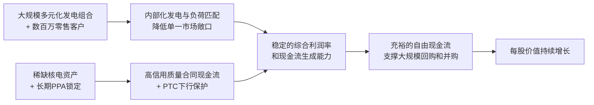

<!-- 匹配到的证券/行业：Vistra(VST.N) -->
操作成功

### 一页通 （Vistra (VST.N)）
日期：2026-08-06
内容："""
## 公司概况

Vistra Corp. 是一家总部位于美国德州的综合电力公司，业务覆盖从加州到缅因州的18个州及哥伦比亚特区。公司采用“发电+零售”一体化模式，拥有约44GW的多元化发电组合（天然气62%、煤20%、核能15%、光储3%），同时通过TXU Energy、Ambit Energy等品牌服务约500万居民、商业及工业零售客户。Vistra是美国最大的竞争性电力零售商和最大的竞争性发电商之一，其一体化结构使其能够通过对冲和零售渠道稳定现金流，区别于纯发电或纯零售的竞争对手。  

## 公司近况跟踪

- <strong>Q1 2026业绩超预期</strong>：公司实现调整后EBITDA 14.75亿美元，同比增长约20%，创历年同期新高。发电业务贡献14.26亿美元，主要受PJM市场容量收入增加及2025年底收购的Lotus资产贡献驱动；零售业务贡献6800万美元，受ERCOT极端温和天气部分抵消。  
- <strong>Cogentrix收购推进中</strong>：2025年12月签署协议收购Cogentrix Energy（约5,500MW天然气发电资产，分布于PJM、ISO-NE和ERCOT），总对价约38亿美元（含现金23亿、承担债务15亿、发行500万股Vistra普通股），预计2026年下半年完成交割。该交易将进一步扩大公司在PJM和东北部市场的天然气发电份额。  
- <strong>Meta核电PPA落地</strong>：2026年1月，公司与Meta签署20年期虚拟购电协议，供应总计2,609MW的零碳电力和容量，来自Perry（1,268MW）、Davis-Besse（908MW）核电站的现有容量，以及三座PJM核电站合计433MW的扩容容量。现有容量预计2027年底前全面交付，扩容容量预计2034年底前全面交付。  
- <strong>投资级评级全面达成</strong>：继2025年12月S&P上调至投资级后，2026年3月Fitch亦将Vistra Operations评级上调至BBB-，触发高级担保债务协议的抵押品自动释放条款，显著提升财务灵活性。2026年4月，公司发行40亿美元高级无担保票据用于债务再融资。  
- <strong>Helix数字基础设施平台启动</strong>：2026年6月，Vistra与KKR、科威特投资局、NVIDIA联合发起Helix Digital Infrastructure，初始资本承诺超100亿美元，Vistra作为创始投资者和优先电力供应商，初始出资约10亿美元。该平台旨在为超大规模客户提供数据中心、电力、连接等一站式基础设施解决方案。   

## 短期逻辑

1. <strong>Cogentrix收购完成与指引上修</strong>：Cogentrix交易预计2026年下半年完成，机构测算其2027年可贡献约5.5-6亿美元调整后EBITDA。当前公司2026-2027年官方指引均未包含Cogentrix及Meta PPA的贡献，收购完成后大概率触发指引上修，构成明确的业绩预期差催化剂。以收购对价隐含的7.25x EV/EBITDA（净额）来看，交易价格显著低于Vistra当前约10x的交易倍数，具备明显的价值增厚效应。  

2. <strong>PJM核电PPA开始贡献现金流</strong>：与Meta的Perry和Davis-Besse虚拟PPA预计2026年底开始部分交付，2027年底前全面运行。机构测算PPA价格约$89/MWh，较当前PJM市场电价和容量收入组合存在溢价，且虚拟PPA的FCF转换率接近100%。该部分收入将从2026年下半年起逐步体现在报表中，为2027年业绩提供确定性增量。  

3. <strong>PJM备用采购拍卖落地消除不确定性</strong>：PJM的可靠性备用采购（RBP）拍卖预计2026年9月举行，初始目标约14.9GW（UCAP），但PJM董事会已表示将缩小采购规模至仅覆盖即将到来的2028/29拍卖的缺口。拍卖落地将消除市场对PJM新增供给规模和节奏的最大不确定性，有利于IPPs估值修复。Vistra在PJM拥有超12GW天然气装机，具备参与备用采购和双边合同的灵活性。  

4. <strong>ERCOT远期曲线修复</strong>：2026年Q1 ERCOT经历1950年以来第二暖的一季度，叠加储能大量并网，导致ERCOT远期电价自2025年高点大幅回落。但公司维持ERCOT年负荷增长5%-6%的判断，且4月下旬以来ERCOT夏冬两季远期价格已开始反弹。若夏季高温兑现或大型负荷互联进度超预期，远期曲线存在进一步上行空间，直接利好Vistra在ERCOT的约20GW发电资产的未对冲部分估值。  

## 长期逻辑

1. <strong>AI/数据中心驱动的结构性电力需求增长</strong>：Vistra服务区域（ERCOT和PJM）正处于电力需求的结构性上行周期。公司预计ERCOT至2030年年负荷增长5%-6%（其中大型数据中心贡献10-15GW），PJM年增长2%-3%。尽管这一预测低于部分第三方机构，但更贴近实际物理开发节奏。Vistra拥有约44GW的多元化发电组合，且大量天然气机组当前利用率仅50%-60%，具备以较低边际成本承接增量负荷的能力。公司已通过Comanche Peak（与AWS，1,200MW）和PJM核电站（与Meta，2,609MW）的长期PPA锁定了部分增量需求，剩余约3.2GW核电容量及大量天然气机组仍具备签约潜力。  

2. <strong>“收购-优化-签约”的复合价值创造模式</strong>：Vistra持续通过并购扩大发电组合规模，并利用其一体化平台的商业优化能力和客户关系为收购资产增值。2024年收购Energy Harbor（4,048MW核电），2025年收购Lotus（2,600MW天然气），2026年收购Cogentrix（5,500MW天然气），均以低于重置成本的价格成交。收购后，公司通过将资产纳入其综合对冲和零售体系，提升利用率并稳定现金流，再通过与大客户签订长期PPA进一步提升盈利可见性。这一模式在行业碎片化（前15大IPPs仅占天然气发电装机约46%）的背景下仍有较大空间。  

3. <strong>核电资产的稀缺性和溢价能力</strong>：Vistra拥有美国第二大的核电组合（6,448MW），仅次于Constellation Energy。核电因其24/7零碳特性，成为超大规模客户（Hyperscalers）最青睐的电源类型。已签署的Comanche Peak和PJM核电PPA均体现了显著高于市场电价的溢价水平（机构测算约$89-$95/MWh）。公司还在推进PJM核电站433MW扩容项目（获Meta PPA支持），以及Comanche Peak 200MW潜在扩容。核电资产在AI时代的稀缺价值有望持续转化为长期、高信用质量的合同现金流。  

4. <strong>强劲的自由现金流与股东回报能力</strong>：公司预计2026-2027年累计产生超100亿美元现金流，扣除约30亿美元股东回报（回购+股息）和40亿美元增长投资后，仍有约30亿美元灵活资金。机构测算2028年FCF收益率（不含未宣布的数据中心交易和回购）约11%-14%，含回购后可达16%以上。公司自2021年启动回购计划以来已累计授权77.5亿美元，截至2026年5月1日已回购约1.67亿股（约占流通股的30%），持续的大规模回购为每股价值增长提供了稳定支撑。  

## 风险提示

- <strong>PJM容量市场改革风险</strong>：PJM当前容量价格处于历史高位（2027/28拍卖清算价$333/MW-day），但面临来自政治层面（可负担性担忧）和监管层面（FERC对PJM治理的改革压力）的双重压力。PJM已发布白皮书探讨长期容量市场改革路径，方向大概率是降低对现有机组的补偿水平。机构测算若PJM容量价格从当前水平降至$200/MW-day，Vistra的EBITDA将减少约4-6亿美元（约占2028年预计EBITDA的6%）。公司约14%-15%的EBITDA来自PJM容量收入（含Cogentrix后），这一风险虽已部分反映在估值中，但改革细节的不确定性仍是主要悬置因素。  

- <strong>ERCOT电价下行风险</strong>：ERCOT远期电价自2025年高点显著回落，2028年远期电价较2025年5月下降约$1-$3/MWh。驱动因素包括：储能和光伏持续大量并网、大型负荷互联进度慢于预期、以及温和天气压制现货价格。尽管公司2026-2027年发电量已基本完成对冲，但2028年及以后的未对冲部分面临电价假设下调的风险。若ERCOT负荷增长不及公司预期的5%-6%，远期曲线可能进一步承压。  

- <strong>大型负荷签约节奏放缓</strong>：尽管公司管理层表示客户参与度未下降，但PJM备用采购规则的不确定性、FERC共址规则细化进程、以及部分州对数据中心的本地反对声浪，均可能导致超大规模客户推迟签约决策。Constellation Energy近期亦提及客户存在一定观望情绪。若Beaver Valley核电站（1,872MW，Vistra在PJM最后一座未签约核电站）和Comanche Peak 2号机组的签约进度显著慢于市场预期，将削弱公司的长期增长叙事。  

## 近期要闻

- <strong>2026年4月</strong>：Vistra Operations发行40亿美元高级无担保票据（2028、2031、2033、2036年到期），用于偿还2027年到期的5.625%优先票据和Term Loan B-3贷款，并释放了全部抵押品留置权，标志着公司正式进入投资级融资时代。 
- <strong>2026年5月7日</strong>：公司发布Q1 2026业绩，调整后EBITDA 14.75亿美元超市场预期，重申2026年全年指引，并维持2027年调整后EBITDA中点机会区间。  
- <strong>2026年5月19日</strong>：PJM董事会致函利益相关方，表示计划将可靠性备用采购拍卖加速至2026年9月，而非原计划的2027年3月，并缩小采购规模至仅覆盖即将到来的2028/29拍卖缺口。 
- <strong>2026年6月11日</strong>：Vistra与KKR、科威特投资局、NVIDIA联合宣布发起Helix Digital Infrastructure平台，初始资本承诺超100亿美元，Vistra作为创始投资者和优先电力提供商参与。  

## 未来催化

- <strong>2026年下半年</strong>：Cogentrix收购预计完成交割，届时公司将更新2026-2027年财务指引，纳入Cogentrix和Meta PPA的贡献。  
- <strong>2026年9月</strong>：PJM可靠性备用采购拍卖预计举行，拍卖结果将明确新增供给的规模、类型和价格，消除市场对PJM供需平衡的最大不确定性。  
- <strong>2026年Q3-Q4</strong>：与Meta的Perry和Davis-Besse虚拟PPA预计开始部分交付，首次在报表中体现核电PPA的增量现金流贡献。 
- <strong>2026年下半年</strong>：Beaver Valley核电站或Comanche Peak 2号机组的潜在签约进展。管理层在Q1电话会和6月J.P. Morgan会议上均表示客户讨论持续进行，FERC共址规则和PJM大负荷互联改革的推进可能加速谈判进程。  

## 公司业务模式及拆分

### 业务边际变化

Vistra近年经历了从以煤电和天然气为主的传统IPP向“核电+天然气+零售”综合平台的战略转型。2024年收购Energy Harbor（4,048MW核电及零售业务），2025年收购Lotus（2,600MW天然气），2026年宣布收购Cogentrix（5,500MW天然气），使公司天然气装机从2023年底约22GW增至收购完成后的约33GW，核电装机从2,400MW增至6,448MW。同时，公司加速淘汰煤电资产（计划2027-2028年退役约4.6GW煤电），并将部分煤电厂址改造为天然气发电或光储项目。在收入端，公司通过Comanche Peak（AWS）和PJM核电站（Meta）的长期PPA，将部分核电资产从纯商品化发电转化为合同化现金流，显著提升了盈利稳定性。  

### 盈利模式

Vistra的核心盈利模式是通过“发电-零售”一体化平台赚取电力和容量的价差。公司利用其多元化发电组合（核电、天然气、煤电、光储）生产电力，通过自有零售品牌（TXU Energy等）向终端用户销售，同时在批发市场进行电力和燃料的对冲交易，锁定利润率。这一模式的关键优势在于：零售端提供稳定的负荷需求，发电端提供成本可控的电力供给，两者结合可降低对单一市场电价的依赖。近年来，公司通过与大客户签订长期PPA（如AWS、Meta），将部分发电资产的收入从商品化转向合同化，进一步提升了现金流的可预测性。公司还通过核电厂的生产税收抵免（PTC，2024-2032年有效，最高$15/MWh）获得额外收入支持。  

### 业务拆分

Vistra的业务按运营性质分为五个报告分部：<strong>零售（Retail）</strong>、<strong>德州发电（Texas）</strong>、<strong>东部发电（East）</strong>、<strong>西部发电（West）</strong>和<strong>资产关闭（Asset Closure）</strong>。其中，零售分部负责向终端用户销售电力和天然气；Texas、East、West分部按地理区域划分发电业务；Asset Closure分部负责退役电厂的环境修复和拆除。  

从近年业务结构看，East分部受益于Energy Harbor和Lotus收购，收入和利润占比大幅提升，已成为公司最大的利润中心。Texas分部仍是最重要的发电基地之一，但受ERCOT电价波动影响较大。零售分部提供稳定的利润贡献，但2025年因供应链优化带来的一次性收益不可持续，2026年预计回落至正常水平。公司当前处于<strong>业绩兑现期</strong>：前期大规模并购带来的产能和协同效应正在逐步释放，同时核电PPA开始贡献增量现金流。  

<strong>细分业务拆分</strong>

| 业务分部 | 指标 | FY2023 | FY2024 | FY2025 | Q1 2026 |
|---|---|---|---|---|---|
| <strong>Retail</strong> | 收入（亿美元） | 105.72 | 127.97 | 143.40 | 36.89 |
| | 同比（%） | - | +21.0% | +12.1% | +16.4% |
| | 调整后EBITDA（亿美元） | - | 14.63 | 16.22 | 0.68 |
| <strong>Texas</strong> | 收入（亿美元） | 39.79 | 53.94 | 53.53 | 29.87 |
| | 同比（%） | - | +35.6% | -0.8% | +1322.4% |
| | 调整后EBITDA（亿美元） | - | 20.32 | 18.34 | 5.86 |
| <strong>East</strong> | 收入（亿美元） | 58.90 | 56.61 | 61.74 | 22.60 |
| | 同比（%） | - | -3.9% | +9.1% | +63.8% |
| | 调整后EBITDA（亿美元） | - | 20.17 | 22.82 | 8.01 |
| <strong>West</strong> | 收入（亿美元） | 8.66 | 8.39 | 3.25 | 0.89 |
| | 同比（%） | - | -3.1% | -61.3% | -43.3% |
| | 调整后EBITDA（亿美元） | - | 2.25 | 2.44 | 0.56 |
| <strong>Asset Closure</strong> | 调整后EBITDA（亿美元） | - | -1.04 | -0.74 | -0.19 |

*注：收入为各分部运营收入（含分部间销售），调整后EBITDA为公司披露口径。FY2023分部调整后EBITDA未在资料中完整披露。*

<strong>Retail（零售）</strong>

零售分部通过TXU Energy、Ambit Energy、Dynegy Energy Services等多个品牌，在16个州和哥伦比亚特区向约500万居民、商业和工业客户销售电力和天然气。收入主要来自客户按用电量支付的电费，利润取决于零售电价与采购成本之间的价差。Q1 2026零售调整后EBITDA为6800万美元，同比下降63%，主要受ERCOT经历1950年以来第二暖的一季度影响，取暖需求大幅减少，客户用电量下降。公司预计2026年全年零售EBITDA将较2025年的创纪录水平（16.22亿美元）有所回落，但仍有望维持在14亿美元左右的中期目标区间。2025年零售表现强劲部分得益于供应链优化带来的一次性收益，该因素在2026年不可持续。  

<strong>Texas（德州发电）</strong>

Texas分部涵盖公司在ERCOT市场的所有发电资产（不含已退役或计划退役的资产），包括Comanche Peak核电站（2,400MW）、约8.4GW天然气联合循环机组、约4.2GW天然气调峰机组、约3.9GW煤电机组及约538MW光伏。Q1 2026该分部调整后EBITDA为5.86亿美元，同比增长约20%，主要受益于更高的对冲电价实现和Martin Lake 1号机组恢复运行（该机组2024年11月发生火灾后于2026年2月恢复）。ERCOT市场没有容量市场机制，收入完全依赖电能量和辅助服务市场，因此电价波动对该分部影响较大。公司已对2026年Texas发电量进行100%对冲，2027年对冲比例约59%（天然气）至100%（核/煤/可再生能源）。  

<strong>East（东部发电）</strong>

East分部涵盖PJM、MISO、ISO-NE和NYISO市场的发电资产，是公司最大的利润中心。资产包括Beaver Valley、Perry、Davis-Besse三座核电站（合计约4,048MW）、约9.8GW天然气联合循环机组、约2.3GW天然气调峰机组、约4.6GW煤电机组及少量光伏。Q1 2026调整后EBITDA为8.01亿美元，同比增长约56%，主要驱动力包括：PJM容量市场价格大幅上涨（2025/26规划年RTO区域清算价$269.92/MW-day，2026/27年$329.17/MW-day）、2025年底收购的Lotus资产贡献（约6800万美元）、以及更高的发电量和对冲电价实现。PJM容量收入是该分部的重要利润来源，机构测算约占公司总EBITDA的14%-15%（含Cogentrix后）。East分部2026年发电量已基本完成对冲（核/煤/可再生能源98%-100%，天然气99%），2027年对冲比例约65%-90%。  

<strong>West（西部发电）</strong>

West分部涵盖CAISO市场的资产，主要包括Moss Landing天然气电厂和电池储能系统。受2025年1月Moss Landing 300MW电池火灾事件影响，该电站和Moss Landing 100MW电池已永久关闭并转入Asset Closure分部，Moss Landing 350MW电池预计2026年中恢复运行（但存在不确定性）。Q1 2026调整后EBITDA为5600万美元，同比下降约10%。该分部在公司整体利润中占比较小。  

<strong>Asset Closure（资产关闭）</strong>

该分部负责退役电厂的环境修复、拆除和矿地复垦，不产生经营收入。Q1 2026调整后EBITDA为-1900万美元，主要反映Moss Landing电池火灾后的修复成本和环境责任应计。  

## 核心竞争力

<strong>竞争要素 1：依托“发电-零售”一体化平台的综合运营优势</strong>

- <strong>护城河定性</strong>：Vistra的“发电+零售”一体化模式属于<strong>结构性护城河</strong>。该模式使公司能够在内部实现发电和负荷的匹配，通过零售端锁定终端客户需求，通过发电端控制供给成本，并通过跨板块的对冲交易管理商品价格风险。这种垂直整合在竞争性电力市场中较为稀缺，新进入者难以在短期内同时建立大规模发电组合和数百万零售客户基础。  
- <strong>数据验证</strong>：Q1 2026，尽管ERCOT经历极端温和天气导致零售用电量下降，但发电业务的强劲表现（Texas和East分部合计调整后EBITDA 13.87亿美元）有效对冲了零售端的疲软，使公司整体调整后EBITDA仍实现20%的同比增长。公司2026年调整后EBITDA指引中点为72亿美元，较2025年增长约22%，体现了综合模式在应对单一业务波动时的韧性。相比之下，纯发电或纯零售的竞争对手在面临类似市场条件时，盈利波动性通常更大。  
- <strong>动态演变</strong>：护城河正在<strong>变宽</strong>。随着公司通过收购持续扩大发电组合规模（2024-2026年新增约12GW），并通过与Meta、AWS等超大规模客户签订长期PPA，一体化平台的规模效应和客户锁定能力进一步增强。更大的发电组合为零售业务提供了更灵活的采购选择，而更多的零售客户则为发电资产提供了更稳定的负荷出口。  

<strong>竞争要素 2：核电资产的稀缺性和长期合同锁定</strong>

- <strong>护城河定性</strong>：Vistra拥有的6,448MW核电组合构成<strong>结构性护城河</strong>。美国现有核电机组是稀缺资产（新建核电面临极高的资本门槛、漫长的建设周期和严格的监管审批），而核电因其24/7零碳特性，在AI和数据中心驱动的电力需求增长背景下，成为超大规模客户最青睐的电源类型。Vistra已通过20年期PPA锁定了部分核电资产（Comanche Peak 1,200MW与AWS，PJM核电站2,176MW与Meta），这些合同的定价显著高于当前市场电价，为相关资产提供了长期、高信用质量的现金流。  
- <strong>数据验证</strong>：机构测算Meta PPA的隐含电价约$89/MWh（现有容量）和$118/MWh（扩容容量），较PJM当前市场电价和容量收入组合存在明显溢价。Comanche Peak PPA的隐含电价估计在$90-$100/MWh区间。公司预计Meta PPA和Cogentrix收购合计将为2027年FCFbG/股提供约$3.5的增量（基于2026年指引中点）。此外，核电厂还享有联邦PTC支持（2024-2032年，最高$15/MWh），在电价下行时提供额外缓冲。  
- <strong>动态演变</strong>：护城河<strong>维持</strong>。公司剩余未签约的核电容量（Beaver Valley约1,872MW和Comanche Peak 2号机组1,200MW）仍具备签约潜力，但签约节奏受PJM监管改革、共址规则和客户决策进度的影响，存在不确定性。若这些资产成功签约，护城河将进一步拓宽；若签约进度显著慢于预期，则核电资产的溢价能力可能受到市场质疑。  

<strong>现阶段核心驱动力总结</strong>：

Vistra的Alpha来源于其一体化平台在商品化电力市场中实现超额利润的能力，以及通过大规模回购持续提升每股价值的资本配置纪律。Beta则来源于AI/数据中心驱动的电力需求增长这一行业顺风，以及ERCOT和PJM市场电价和容量价格的波动。公司约80%的EBITDA仍为商品化敞口（未通过长期PPA锁定），因此其盈利对市场电价的敏感度仍然较高。 

<strong>竞争格局传导逻辑图</strong>：

## 产销链

### 客户情况

Vistra的客户结构分为两类：<strong>零售客户</strong>和<strong>批发/大客户</strong>。  

- <strong>零售客户</strong>：公司通过TXU Energy、Ambit Energy等品牌服务约500万居民、商业和工业用户，主要集中在德州（约260万）。零售客户提供稳定的负荷基础，是公司一体化模式的重要组成部分。零售业务的客户获取成本（佣金和营销）和坏账费用是主要成本项，Q1 2026坏账费用为4200万美元。零售客户集中度极低，不存在单一客户依赖风险。  
- <strong>批发/大客户</strong>：近年来，超大规模客户（Hyperscalers）成为公司日益重要的客户群体。已签约的AWS（Comanche Peak 1,200MW）和Meta（PJM核电站2,609MW）代表了这一趋势。这些合同期限长达20年，定价高于市场电价，显著提升了相关资产的盈利可见性。公司正在就剩余核电容量（Beaver Valley、Comanche Peak 2号机组）和天然气资产与潜在客户进行讨论，但签约节奏受监管环境和客户决策进度影响。  

### 供应商情况

- <strong>天然气</strong>：天然气是公司最大的燃料成本项（约62%的装机容量为天然气机组）。公司通过现货市场和短期合同采购天然气，并辅以管道运输和储气协议确保供应可靠性。美国天然气供应充足（尤其是Permian盆地伴生气），价格总体维持在低位（2026年Q1 Henry Hub均价约$4.90/MMBtu，Houston Ship Channel约$3.26/MMBtu），对公司的天然气发电利润构成支撑。  
- <strong>核燃料</strong>：公司通过全球多元化供应商采购铀及转换、浓缩和制造服务，核燃料合同已覆盖至2030年的所有换料需求。2024年《禁止俄罗斯铀进口法》生效后，公司已建立战略库存并部署缓解策略，2026-2027年换料计划未受影响。  
- <strong>煤炭</strong>：公司通过不同期限的合同从多个供应商采购煤炭，通过铁路或驳船运输至电厂。随着煤电机组计划退役（2027-2028年约4.6GW），煤炭采购量将逐步减少。  

### 经销商情况

公司零售业务不依赖第三方经销商，而是通过自有品牌和内部销售团队直接获取客户。零售电费收入直接来自终端用户，无中间经销商环节。 

<strong>成本传导能力定性</strong>：Vistra赚取的主要是“一体化平台优化收益”和“核电稀缺溢价”，而非单纯的“加工费”或“周期资源钱”。当上游燃料（天然气）价格上涨时，公司可通过零售端调价和对冲交易将部分成本传导至下游；当电价上涨时，发电端受益，零售端承压，但一体化结构可内部对冲。核电PPA的固定价格条款则为相关资产提供了独立于燃料价格波动的稳定收益。  

## 财务数据

| 财务指标 | FY2023 | FY2024 | FY2025 | Q1 2026 |
|---|---|---|---|---|
| <strong>截止日期</strong> | 2023-12-31 | 2024-12-31 | 2025-12-31 | 2026-03-31 |
| 营业收入（亿美元） | 147.79 | 172.24 | 177.38 | 56.40 |
| 同比（%） | +7.66% | +16.54% | +2.98% | +43.40% |
| 营业成本（亿美元） | 92.59 | 96.99 | 119.04 | 32.30 |
| 毛利率（%） | 37.35% | 43.69% | 32.89% | 42.73% |
| 营业利润（亿美元） | 27.10 | 40.81 | 21.34 | 14.99 |
| 归母净利润（亿美元） | 13.43 | 24.67 | 7.52 | 9.80 |
| 同比（%） | +197.53% | +83.69% | -69.52% | +409.15% |
| 稀释EPS（美元） | 3.58 | 7.00 | 2.18 | 2.87 |
| 经营活动现金流（亿美元） | 54.53 | 45.63 | 40.70 | 11.99 |
| 资本支出（亿美元） | 27.47 | 33.04 | 39.41 | 8.83 |
| 自由现金流（亿美元） | 27.06 | 12.59 | 1.29 | 3.16 |

*注：自由现金流 = 经营活动现金流 - 资本支出。毛利率 = (营业收入 - 营业成本) / 营业收入。*

### 财务分析

<strong>成长能力</strong>：公司营收在FY2024受益于Energy Harbor并表实现16.54%的增长，FY2025增速放缓至2.98%主要受Moss Landing火灾导致的West分部收入下降和ERCOT电价回落影响。Q1 2026营收同比增长43.40%，主要受PJM容量收入增加、Lotus资产贡献以及未实现对冲收益的波动影响。归母净利润波动较大，FY2025同比下降69.52%主要因未实现商品衍生品损失和Moss Landing资产减值，Q1 2026同比增长409.15%则受益于未实现商品衍生品收益的逆转。<strong>投资者应关注调整后EBITDA而非GAAP净利润来评估公司的经营趋势</strong>，因为未实现对冲损益会显著扭曲净利润。FY2025调整后EBITDA为58.38亿美元（同比+5.4%），Q1 2026为14.75亿美元（同比+20%）。  

<strong>盈利能力</strong>：毛利率在FY2025下降至32.89%，主要因燃料和购电成本上升（同比+22.7%），部分被零售电价上涨所抵消。Q1 2026毛利率回升至42.73%，反映PJM容量收入增加和发电利润率改善。公司调整后EBITDA利润率在FY2025约为32.9%，处于健康水平。  

<strong>运营能力</strong>：应收账款周转天数在Q1 2026约为32天（年化），较FY2025的48天有所改善。存货周转天数约为29天（年化），与FY2025基本持平。公司运营资金管理总体稳定。  

<strong>偿债能力</strong>：截至Q1 2026，公司总债务约191.63亿美元（含短期债务、长期债务和应收账款融资），现金及等价物6.34亿美元，净债务约185.29亿美元。净债务/调整后EBITDA（年化Q1）约为3.1x，处于公司目标区间（<3.0x）的上沿。2026年4月完成40亿美元票据发行和债务再融资后，公司获得投资级评级，融资成本有望进一步下降。Q1 2026利息支出2.63亿美元，利息覆盖倍数（调整后EBITDA/利息支出）约5.6x，处于健康水平。  

<strong>杜邦分析（FY2025）</strong>：ROE = 净利润率（4.24%）× 资产周转率（0.43x）× 权益乘数（8.13x）= 14.8%。权益乘数较高反映了公司较高的财务杠杆，但这是资本密集型电力行业的普遍特征。净利润率受未实现对冲损失和资产减值拖累，调整后净利润率约为32.9%。  

## 行业及竞争分析

### 行业赛道：美国竞争性电力市场

Vistra主要在美国的竞争性电力批发市场和零售市场运营，核心市场为ERCOT（德州）和PJM（东部13个州及哥伦比亚特区），次要市场包括ISO-NE、NYISO、MISO和CAISO。这些市场采用边际定价机制，电价由满足需求的最后一单位电力的成本决定（通常为天然气机组），因此天然气价格是影响批发电价的关键变量。  

<strong>需求端</strong>：AI/数据中心的快速发展正在根本性改变美国电力需求的增长轨迹。据公司估计，ERCOT至2030年年负荷增长5%-6%，PJM年增长2%-3%，远高于此前约0.5%的长期年均增速。EIA和第三方咨询机构的预测更为激进。数据中心不仅增加总用电量，且其24/7的负荷特性对电网的可靠性和可调度电源提出了更高要求。  

<strong>供给端</strong>：新增发电容量面临多重瓶颈：天然气电厂建设周期3-5年，核电新建周期10年以上，且均面临供应链约束、劳动力短缺和监管审批延迟。可再生能源（风光）虽然建设周期较短，但其间歇性无法独立满足数据中心的24/7需求。因此，现有可调度发电资产（尤其是天然气和核电）的稀缺性价值显著提升。PJM的备用采购拍卖（RBP）正是为了应对这一供给缺口而设立。  

<strong>竞争格局</strong>：竞争性电力市场高度碎片化。Vistra的主要竞争对手包括其他独立发电商（IPP）如Constellation Energy（核电为主）、NRG Energy（天然气和零售为主）、Talen Energy（核电和天然气），以及受监管的公用事业公司的竞争性子公司和金融投资者持有的发电资产。竞争维度包括：发电成本、燃料获取、商业优化能力、客户关系、以及获取新项目开发所需土地和电网互联的能力。  

<strong>可比公司</strong>：

| 公司名称 | 股票代码 | 主要发电类型 | 装机容量（约） | 核心市场 | 差异化特征 |
|---|---|---|---|---|---|
| Constellation Energy | CEG | 核电为主 | ~32GW | PJM, NYISO等 | 美国最大核电运营商，核电PPA签约领先 |
| NRG Energy | NRG | 天然气为主 | ~25GW | ERCOT, PJM | 强零售平台，德州新增天然气项目布局积极 |
| Talen Energy | TLN | 核电+天然气 | ~10GW | PJM为主 | 高PJM敞口，Susquehanna核电站与AWS共址 |
| Vistra Corp. | VST | 多元化（气/核/煤/光储） | ~44GW | ERCOT, PJM | 最大竞争性发电商之一，一体化零售平台，核电组合第二 |

<strong>总结分析</strong>：Vistra在竞争性电力行业中处于领先地位，其核心竞争优势在于：1）规模最大的多元化发电组合之一，可在不同市场条件下灵活调配；2）独特的“发电+零售”一体化模式，提供内在的盈利稳定性；3）第二大的核电组合，在AI时代具备稀缺性溢价能力；4）强大的商业优化和风险管理能力。与Constellation相比，Vistra的核电敞口较小但天然气和零售敞口更大，盈利来源更分散；与NRG相比，Vistra的核电资产提供了差异化优势；与Talen相比，Vistra的规模和多元化程度更高，PJM容量市场的集中风险相对较低。  

## 市场焦点议题

<strong>议题一：PJM容量市场改革的路径与影响</strong>

- <strong>背景</strong>：PJM容量市场价格在过去两年从约$30/MW-day飙升至$333/MW-day，引发政治层面的可负担性担忧。PJM已发布白皮书探讨长期改革方案，FERC也启动了PJM治理改革的技术会议。同时，PJM的可靠性备用采购（RBP）拍卖预计2026年9月举行，旨在引入新供给以缓解供需紧张。  
- <strong>问题列表</strong>：
  - PJM长期容量市场改革最可能的结果是什么？现有机组的容量收入是否会大幅下降？
  - RBP拍卖将引入多少新供给？以何种电源类型（天然气调峰 vs. 联合循环）为主？对现有资产的电能量利润有何影响？
  - Vistra在PJM的约12GW天然气资产中，有多少可能通过RBP或双边合同获得增量收入？有多少面临利润被挤压的风险？

<strong>议题二：大型负荷签约的节奏和定价趋势</strong>

- <strong>背景</strong>：Vistra已与AWS和Meta签署了合计约3,800MW的核电PPA，但剩余约3,200MW核电容量及大量天然气资产尚未签约。市场对后续签约的节奏和定价存在分歧，尤其是PJM监管不确定性和部分州的本地反对声浪可能延缓决策。  
- <strong>问题列表</strong>：
  - Beaver Valley核电站（1,872MW）的签约前景如何？潜在客户是谁？预期定价区间？
  - 天然气资产签约的可能性有多大？是以“过渡电源”、“共址”还是“虚拟PPA”的形式？
  - 在PJM备用采购和FERC共址规则明确之前，超大规模客户是否愿意继续签署长期合同？

<strong>议题三：ERCOT远期电价与负荷增长的预期差</strong>

- <strong>背景</strong>：ERCOT远期电价自2025年高点显著回落，而公司维持5%-6%的年负荷增长预测。市场对负荷互联速度（“批次零”流程）、储能大量并网的影响以及温和天气的持续性存在担忧。  
- <strong>问题列表</strong>：
  - ERCOT远期曲线是否低估了未来的负荷增长和电价上涨潜力？
  - 储能的大量并网是否会对天然气调峰机组的利润产生结构性压制？
  - 公司5%-6%的负荷增长预测中，有多少已反映在当前的远期电价中？

## 市场分歧探讨

<strong>核心分歧：Vistra当前估值是否已充分反映PJM容量市场改革和ERCOT电价下行的风险，还是过度悲观地忽视了核电PPA和天然气资产的价值？</strong>

<strong>看多方的逻辑与依据</strong>：

1. <strong>估值已反映悲观情景</strong>：以FY2028预计FCF计算，Vistra当前交易价格对应约11%-14%的FCF收益率（不含未宣布的数据中心交易和回购），含回购后可达16%以上。机构测算，若将约80%的非合同化EBITDA按7.0x EV/EBITDA估值、约20%的合同化EBITDA按12.0x估值，混合倍数约8.0x，而Vistra当前交易于约7.3x-8.1x FY28 EV/EBITDA，已接近这一“谷底”估值水平，未给予任何未来数据中心交易的期权价值。 
2. <strong>核电PPA提供下行保护</strong>：已签署的Comanche Peak和PJM核电PPA锁定了约20%的EBITDA，定价显著高于市场电价，且合同期限长达20年。这部分现金流具有债券属性，应获得更高的估值倍数。 
3. <strong>天然气资产存在实物期权价值</strong>：Vistra在ERCOT和PJM拥有超30GW的天然气装机，在当前新电厂建设周期长、成本高的环境下，这些现有资产具备“速度优势”，可通过“过渡电源”、“共址”或双边合同等方式为急于获得电力的大型客户提供解决方案，这一实物期权价值在当前估值中未被充分反映。 
4. <strong>管理层持续回购彰显信心</strong>：公司自2021年以来已回购约30%的流通股，且2026年回购节奏加快（前四个月约5.25亿美元），表明管理层认为股价被低估。  

<strong>看空方的逻辑与依据</strong>：

1. <strong>PJM容量市场改革是结构性利空</strong>：当前PJM容量价格处于不可持续的高位，政治和监管压力将推动改革，使容量价格向$175-$200/MW-day的“固定运营成本”水平回归。这将直接减少Vistra约4-6亿美元的年度EBITDA（约占6%），且这一风险尚未完全反映在卖方预测中。  
2. <strong>ERCOT电价面临结构性下行压力</strong>：ERCOT市场正经历光伏和储能的爆发式增长，尽管负荷也在增长，但供给增速可能阶段性超过需求增速，导致电价承压。2028年及以后的远期电价已较2025年高点显著回落，且可能进一步下行。  
3. <strong>大型负荷签约故事可能落空</strong>：PJM监管不确定性、FERC共址规则细化进程缓慢、以及部分州对数据中心的本地反对，可能导致超大规模客户推迟或放弃与现有发电资产签约，转而寻求自建或与新建项目合作。Beaver Valley的签约前景存在重大不确定性。  
4. <strong>估值并非如看多方所言的便宜</strong>：若剔除一次性因素和未实现收益，Vistra的经常性盈利倍数并不低。且公司杠杆率较高（净债务/EBITDA约3.1x），在利率维持高位的环境下，高杠杆可能放大盈利下滑对股权的冲击。  

<strong>综合分析</strong>：当前市场对Vistra的定价似乎更接近看空方的逻辑，即给予PJM容量改革和ERCOT电价下行较高的权重，而对核电PPA的稳定现金流和天然气资产的实物期权价值给予较低权重。从风险收益比角度看，若PJM容量改革最终温和落地（如容量价格维持在$200/MW-day以上）且ERCOT负荷增长兑现，当前估值水平提供了较有吸引力的买入机会。但若改革力度超预期或大型负荷签约持续落空，股价可能进一步承压。 

## 盈利预测与估值

| 机构 | 评级 | 目标价（美元） | 财务指标 | FY2025A | FY2026E | FY2027E | FY2028E |
|---|---|---|---|---|---|---|---|
| Jefferies (2026-05-21) | Buy | 190.00 | 调整后EBITDA(百万美元) | 5,912 | 7,311 | 9,242 | 9,318 |
| | | | 调整后EPS(美元) | 5.63 | 8.15 | 12.21 | 12.99 |
| | | | FCFbG(百万美元) | 3,592 | 4,316 | 6,182 | 6,416 |
| 摩根大通 (2026-07-29) | Overweight | 231.00 | 调整后EBITDA(百万美元) | 5,838 | 7,124 | 8,000 | 8,769 |
| | | | DCF/股(美元) | 8.97 | 12.92 | 16.13 | 19.29 |
| 瑞银 (2026-03-27) | Buy | 233.00 | 调整后EBITDA(百万美元) | - | 7,260 | 8,478 | 9,285 |
| | | | 调整后EPS(美元) | 4.93 | 9.89 | 13.00 | 16.14 |
| 摩根士丹利 (2026-06-12) | Overweight | 212.00 | 调整后EPS(美元) | 2.18 | 8.60 | 9.44 | 10.05 |

*注：各机构对调整后EBITDA和FCF的定义可能存在口径差异。Jefferies的FCFbG为“增长前自由现金流”。*

<strong>盈利预测与估值分析</strong>：

机构间对Vistra的盈利预测存在一定分歧，尤其是FY2027-FY2028的调整后EBITDA预测范围较宽（80亿至92亿美元），主要源于对Cogentrix收购完成时间、Meta PPA贡献节奏、以及PJM容量价格假设的不同处理。Jefferies和瑞银的预测相对乐观，已纳入Cogentrix和核电PPA的贡献；摩根大通的预测相对保守，可能未完全纳入上述因素。  

估值方法上，各机构普遍采用<strong>分类加总估值法（SOTP）</strong>，将核电合同化现金流、核电商品化现金流、天然气发电、零售等不同业务分别赋予不同的FCF收益率或EV/EBITDA倍数。核电PPA部分通常采用7.0%的FCF收益率（约14x EV/EBITDA），商品化天然气发电采用10%-11%的FCF收益率（约9x EV/EBITDA），零售采用12%-13%的FCF收益率（约8x EV/EBITDA）。目标价范围在$190-$233之间，较当前股价（约$144-$152）存在25%-53%的上行空间。  

<strong>管理层指引</strong>：公司2026年调整后EBITDA正式指引为68亿-76亿美元（中点72亿美元），调整后FCFbG指引为39.25亿-47.25亿美元（中点43.25亿美元）。2027年调整后EBITDA中点机会区间为74亿-78亿美元（中点76亿美元）。上述指引均<strong>未包含</strong>Cogentrix收购和Meta PPA的潜在贡献。公司预计Cogentrix和Meta PPA现有容量部分合计将为2027年FCFbG/股提供约$3.5的增量（基于2026年指引中点）。
"""
