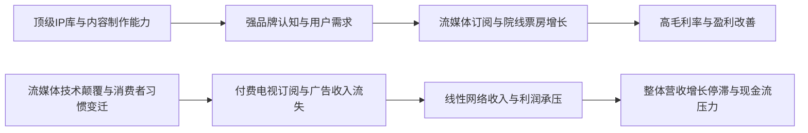

<!-- 匹配到的证券/行业：华纳兄弟探索(WBD.O) -->
操作成功

### 一页通 （华纳兄弟探索 (WBD.O)）
日期：2026-08-06
内容："""
## 公司概况

华纳兄弟探索（Warner Bros. Discovery, WBD）是一家全球领先的媒体与娱乐集团，由2022年Discovery与AT&T旗下WarnerMedia合并而成。公司业务横跨影视制作、有线电视网络、流媒体服务及互动游戏，旗下拥有HBO、CNN、DC Studios、华纳兄弟影业、Discovery频道、TNT Sports等标志性品牌。公司拥有全球最大的自有内容库之一，覆盖体育、新闻、生活方式及娱乐领域。当前，公司正处于被Paramount Skydance Corporation（PSKY）以每股31美元现金全资收购的进程中，该交易预计于2026年第三季度完成。  

## 公司近况跟踪

- <strong>PSKY收购交易遭遇州级诉讼，完成时间推迟</strong>：2026年7月13日，以加利福尼亚州为首的12个美国州向联邦法院提起诉讼，要求阻止PSKY对WBD的收购。联邦法院于7月20日批准了临时限制令（TRO），PSKY同意在法院就案情作出裁决后5天、或不晚于2027年6月1日前不完成交易。此前，该交易已获美国司法部、欧盟委员会等65个司法管辖区的批准。若交易最终被监管机构否决，PSKY需向WBD支付70亿美元的反向分手费。   

- <strong>Q1 2026财报：调整后EBITDA超预期，但FCF大幅为负</strong>：公司Q1营收88.93亿美元，同比-1%，与市场预期持平；调整后EBITDA为22.03亿美元，同比+5%，超出市场预期约12%。超预期主要由制片厂业务（Studios）的强劲表现驱动。然而，受支付给Netflix的28亿美元并购终止费、更高的内容投入及营运资本拖累，公司自由现金流为-4.76亿美元，显著低于市场预期。     

- <strong>流媒体业务（HBO Max）增长强劲</strong>：Q1流媒体营收同比+9%，调整后EBITDA同比+29%至4.38亿美元，利润率提升至15%。受益于英国、德国、意大利等欧洲市场的成功推出，全球订阅用户数在Q1末已显著超过1.4亿，管理层重申2026年底突破1.5亿的目标。广告支持层（ad-lite）用户增长迅速，占全球零售新增用户的50%。     

- <strong>线性网络（Global Linear Networks）持续承压但好于预期</strong>：Q1该板块营收同比-8%，调整后EBITDA同比-9%。广告收入同比-11%，主要受失去NBA版权（造成1.33亿美元负面影响）及国内观众数下降8%的拖累。但剔除NBA影响后，核心广告趋势环比改善。分销收入同比-7%，受国内线性付费电视用户数下降10%的影响。     

- <strong>制片厂业务因内部授权确认方式导致业绩激增</strong>：Q1制片厂营收同比+35%，调整后EBITDA同比+199%至7.75亿美元。这一激增主要由HBO Max国际市场上线带来的内部内容授权收入确认方式所驱动。管理层指引2026年全年制片厂调整后EBITDA将与2025年（25.45亿美元）基本持平。     

## 短期逻辑

1.  <strong>并购套利：押注交易最终完成，获取价差收益</strong>
    当前WBD股价（约27美元）与PSKY的31美元现金收购价之间存在约15%的价差，这反映了市场对交易能否完成的疑虑。核心障碍是12个州提起的反垄断诉讼。乐观方认为，联邦司法部已批准交易，且欧盟在审查后未发现重大竞争问题，州级诉讼的政治动机大于法律依据，最终可能通过和解或快速判决解决。此外，若交易完成时间超过2026年9月30日，PSKY将支付每日约0.00277778美元/股的“计时费”（年化约3.6%的额外收益），进一步增厚套利回报。若交易失败，WBD将获得70亿美元分手费，对股价提供一定支撑。此事件是未来3个月WBD股价最核心的驱动因素。   

2.  <strong>流媒体业务的独立价值重估</strong>
    即便不考虑并购，WBD的流媒体业务（HBO Max）正展现出强劲的增长和盈利能力改善。Q1订阅用户数超1.4亿，管理层指引年底超1.5亿，增长路径清晰。随着国际扩张、广告层渗透率提升及内容 slate 强化（如《哈利·波特》剧集计划），市场可能对WBD的流媒体资产给予更高估值。若并购失败，市场焦点将迅速转向其独立价值，流媒体业务的盈利能力将成为估值锚点。  

## 长期逻辑

1.  <strong>合并后实体（PSKY+WBD）的协同效应与规模优势</strong>
    若交易完成，合并后的“ParaWarner”将成为拥有超过2亿流媒体订阅用户、每年制作超30部院线电影、并整合了CBS、CNN、HBO等顶级品牌的媒体巨头。管理层预计可实现超60亿美元的年度协同效应，主要来自技术平台整合、内容采购优化及营销开支削减。长期目标是在2030年实现超100亿美元的自由现金流。这一规模效应有望使新实体在与Netflix、Disney的竞争中占据更有利的位置，并改善对广告商的议价能力。 

2.  <strong>顶级IP库的长期变现潜力</strong>
    WBD拥有《哈利·波特》、《权力的游戏》、DC宇宙、《指环王》等全球顶级IP。公司正系统性地挖掘这些IP的价值，例如计划于2026年圣诞节推出《哈利·波特》剧集，并开发多款基于核心IP的游戏。这种对经典IP的持续投资和跨媒体叙事能力，是公司长期增长和抵御竞争的核心壁垒。IP价值的释放不仅限于内容订阅，还包括主题乐园、消费品和游戏等多元化收入。    

## 风险提示

- <strong>并购交易失败风险</strong>：这是当前最直接和重大的风险。若州级诉讼成功阻止交易，WBD股价可能回落至并购消息传出前的水平（约12-13美元），尽管70亿美元的分手费能提供一定缓冲，但公司仍需独立面对有线电视业务的结构性衰退和沉重的债务负担。    

- <strong>线性电视业务加速恶化</strong>：WBD的现金流仍高度依赖其线性网络业务。Q1数据显示，国内付费电视订阅用户数同比下滑10%，广告收入也因观众流失和NBA版权丧失而承压。若“剪线”（cord-cutting）趋势加速，或主要分销商（如Comcast、Fubo）在合同续约时进一步压价或放弃转播，将对公司的盈利和现金流产生重大负面影响。   

- <strong>制片厂业务表现波动性</strong>：制片厂业务（Studios）的业绩高度依赖电影上映档期和票房表现。2026年Q1的业绩激增主要由内部授权会计处理驱动，并非现金流的同步改善。2026年后续影片（如《Supergirl》）的票房表现存在不确定性，可能导致制片厂业务盈利大幅波动，无法实现管理层指引的全年持平目标。  

## 近期要闻

- <strong>2026年5月6日</strong>：WBD公布Q1 2026财报，调整后EBITDA超预期，但FCF因支付Netflix分手费而大幅为负。     
- <strong>2026年5月15日</strong>：WBD在年度广告预售会（Upfront）上展示了新的广告技术工具和内容 slate，为可能作为独立实体的最后一次亮相。 
- <strong>2026年7月13日</strong>：以加利福尼亚州为首的12个美国州正式提起诉讼，要求阻止PSKY对WBD的收购。    
- <strong>2026年7月20日</strong>：联邦法院批准了针对该交易的临时限制令（TRO），PSKY同意推迟交易完成时间。   
- <strong>2026年7月22日</strong>：欧盟委员会无条件批准了PSKY对WBD的收购。 

## 未来催化

- <strong>2026年8月7日</strong>：英国竞争与市场管理局（CMA）预计将公布其对PSKY/WBD交易的初步审查决定，可能成为影响交易前景的关键事件。 
- <strong>2026年8月3日当周</strong>：联邦法院将就州级诉讼举行听证会，可能决定是否延长临时限制令（TRO）直至审判，这将直接影响交易完成的时间表。  
- <strong>2026年第三季度</strong>：若交易获得所有必要批准，PSKY预计将在本季度完成对WBD的收购，届时WBD股东将获得每股31美元的现金。  

## 公司业务模式及拆分

<strong>业务边际变化</strong>：公司近年最大的战略变化是围绕并购展开。在2025年宣布分拆计划后，公司最终于2026年2月与PSKY达成整体出售协议。在业务层面，公司正经历从传统线性电视向流媒体（DTC）的战略转型。流媒体业务（HBO Max）通过全球扩张和广告层引入，已成为核心增长引擎。制片厂业务（Studios）则更加聚焦于核心IP的院线发行和内部授权。线性网络业务（Global Linear Networks）则处于管理收缩、聚焦现金流的状态。  

<strong>盈利模式</strong>：WBD的盈利模式正从依赖付费电视订阅费和广告收入的“渠道”模式，转向结合流媒体订阅、院线票房、内容授权和IP衍生变现的混合模式。其核心竞争力在于<strong>大规模、高质量的内容制作能力和丰富的IP库</strong>，通过多种窗口和平台分发以实现价值最大化。 

<strong>业务拆分</strong>：
公司近年业务结构保持稳定，分为三大板块：流媒体（Streaming）、制片厂（Studios）和全球线性网络（Global Linear Networks）。流媒体是增长最快的板块，制片厂是盈利波动最大的板块，而线性网络是当前现金流的主要来源，但处于结构性下滑中。公司当前经营周期处于<strong>并购交易等待期</strong>，基本面受交易相关的一次性项目（如分手费）严重干扰。  

<strong>细分业务拆分</strong> (单位：亿美元)

| 业务板块 | 指标 | FY2024 | FY2025 | Q1 2026 |
|---|---|---|---|---|
| <strong>流媒体 (Streaming)</strong> | 收入 | 103.13 | 108.76 | 28.87 |
| | 同比 | - | +5.5% | +9% |
| | 占比 | 26% | 29% | 32% |
| | 调整后EBITDA | 6.77 | 13.70 | 4.38 |
| <strong>制片厂 (Studios)</strong> | 收入 | 116.07 | 126.19 | 31.25 |
| | 同比 | - | +8.7% | +35% |
| | 占比 | 30% | 34% | 35% |
| | 调整后EBITDA | 16.52 | 25.45 | 7.75 |
| <strong>全球线性网络 (Global Linear Networks)</strong> | 收入 | 201.75 | 176.56 | 43.77 |
| | 同比 | - | -12.5% | -8% |
| | 占比 | 51% | 47% | 49% |
| | 调整后EBITDA | 81.49 | 64.12 | 16.34 |
| <strong>公司/抵消项</strong> | 收入 | -27.74 | -38.55 | -14.96 |
| | 调整后EBITDA | -14.46 | -15.83 | -6.44 |
| <strong>合计</strong> | 收入 | 393.21 | 372.96 | 88.93 |
| | 调整后EBITDA | 90.32 | 87.44 | 22.03 |

*注：占比为各板块收入占合计收入（抵消前）的比例。*

<strong>流媒体 (Streaming)</strong>：Q1 2026收入28.87亿美元，同比+9%。增长主要由分销收入（+7%）和广告收入（+19%）驱动。分销收入增长受益于HBO Max在欧洲新市场的推出和2025年底美国市场的提价。广告收入增长则来自全球广告支持层（ad-lite）用户的增加。调整后EBITDA为4.38亿美元，同比+29%，利润率提升至15.2%，显示出规模效应开始显现。管理层预计订阅用户相关收入增长将在2026年全年加速。   

<strong>制片厂 (Studios)</strong>：Q1 2026收入31.25亿美元，同比+35%。增长主要由内容收入（+37%）驱动，特别是电视产品收入（+58%）和院线产品收入（+21%）。这一激增主要源于HBO Max国际市场上线带来的内部内容授权，导致收入在制片厂端确认。调整后EBITDA为7.75亿美元，同比+199%，同样受上述内部授权交易的会计处理影响。管理层指引2026年全年调整后EBITDA与2025年基本持平，因下半年将面临高基数压力。   

<strong>全球线性网络 (Global Linear Networks)</strong>：Q1 2026收入43.77亿美元，同比-8%。分销收入（-7%）受国内付费电视用户数下降10%的拖累，但部分被2%的费率增长所抵消。广告收入（-11%）主要受失去NBA版权（负面影响7%）和国内观众数下降8%的影响。调整后EBITDA为16.34亿美元，同比-9%，利润率保持在37.3%的高位，因NBA版权费用的节省抵消了部分收入下滑的影响。   

## 核心竞争力

<strong>竞争要素 1：依托顶级IP库和规模化内容制作能力构筑的品牌与议价权</strong>

- <strong>护城河定性</strong>：WBD拥有的《哈利·波特》、DC、《权力的游戏》等全球顶级IP矩阵，以及HBO和华纳兄弟影业百年积累的品牌声誉，构成了<strong>结构性护城河</strong>。这些IP和品牌是吸引用户订阅、进入影院和购买衍生品的核心驱动力，难以在短期内被复制。     
- <strong>数据验证</strong>：2025年，华纳兄弟影业有9部电影登顶票房榜首，7部连续开画票房超4000万美元，创行业纪录。HBO剧集《A Knight of the Seven Kingdoms》单集平均观众达3600万，为HBO史上最受欢迎的首播剧集之一。流媒体订阅用户数从2022年的约9000万增长至2026年Q1的超1.4亿。  
- <strong>动态演变</strong>：<strong>护城河变宽</strong>。公司正通过《哈利·波特》剧集、DC宇宙重启等计划，持续投资和激活其核心IP。与PSKY合并后，IP库将进一步扩大（加入《星际迷航》、《壮志凌云》等），内容制作和全球分发能力将得到增强，进一步巩固其在全球媒体行业的领先地位。   

<strong>竞争要素 2：线性网络业务面临的结构性挑战</strong>

- <strong>护城河定性</strong>：公司的全球线性网络业务（如CNN、TNT、Discovery频道）正面临<strong>行业阶段性逆风</strong>。其传统的“捆绑付费电视”分销模式正被流媒体点播模式所颠覆，导致订阅用户和广告收入持续流失。这并非公司特有的竞争劣势，而是整个付费电视生态系统面临的系统性风险。  
- <strong>数据验证</strong>：Q1 2026，国内线性付费电视用户数同比下降10%，广告收入同比下降11%（剔除NBA影响后下降约6%）。该板块收入已连续多年下滑。  
- <strong>动态演变</strong>：<strong>护城河收缩</strong>。尽管公司通过获取NHL、MLB、NCAA等体育版权和推出CNN All Access来增强内容吸引力，但难以完全抵消“剪线”趋势带来的负面影响。该业务的长期价值取决于其能否成功向流媒体转型，以及管理层能否有效管理其成本结构以维持现金流。  

<strong>现阶段核心驱动力总结</strong>：公司的Alpha在于其强大的IP内容创造和流媒体转型能力，而Beta则在于其线性网络业务与宏观广告市场和付费电视生态的关联。当前，并购交易的进展是压倒一切的基本面变量。 

<strong>竞争格局传导逻辑图</strong>：

## 产销链

- <strong>客户情况</strong>：公司的客户主要分为三类：<strong>消费者</strong>（流媒体订阅用户和院线观众）、<strong>分销商</strong>（有线电视运营商、电信公司等）和<strong>广告商</strong>。Q1 2026，公司分销收入占总收入的55%，广告收入占21%。流媒体订阅用户数已超1.4亿，是增长最快的客户群。广告业务方面，公司正通过推出新的广告技术工具（如Demo Direct、可购物广告）来提升对广告商的吸引力。公司无单一客户收入占比超过10%，客户集中度风险较低。   

- <strong>供应商情况</strong>：公司的核心“供应商”是<strong>创意人才</strong>（编剧、导演、演员、制片人）和<strong>体育联盟</strong>（如NBA、MLB、NHL）。公司通过提供有竞争力的薪酬、创作自由度和强大的分发平台来吸引顶尖人才。在体育版权方面，公司采取纪律性策略，在失去NBA版权后，转而投资NHL、MLB和扩大March Madness转播权，以优化内容成本结构。   

- <strong>成本传导机制</strong>：WBD赚取的是“内容品牌溢价”。当上游创意或版权成本上升时，公司能否顺利转嫁取决于其内容的不可替代性。对于HBO和顶级IP电影，公司拥有较强的定价权，可通过提高订阅价格或电影票价来传导成本。但对于线性网络中可替代性较强的频道，其成本转嫁能力较弱，面临分销商压价和广告预算流失的压力。 

## 财务数据

<strong>关键财务数据</strong> (单位：亿美元)

| 项目 | FY2023 | FY2024 | FY2025 | Q1 2026 |
|---|---|---|---|---|
| <strong>截止日期</strong> | 2023-12-31 | 2024-12-31 | 2025-12-31 | 2026-03-31 |
| 营业总收入 | 413.21 | 393.21 | 372.96 | 88.93 |
| 收入同比 | +22.19% | -4.84% | -5.15% | -0.96% |
| 营业成本 | 245.26 | 229.70 | 208.85 | 46.43 |
| <strong>毛利率</strong> | 40.64% | 41.59% | 44.01% | 47.79% |
| 销售及管理费用 | 176.81 | 163.33 | 151.02 | 37.01 |
| <strong>营业利润</strong> | -8.86 | 0.18 | 13.09 | 5.49 |
| 归母净利润 | -31.26 | -113.11 | 7.27 | -29.16 |
| <strong>基本每股收益 (美元)</strong> | -1.28 | -4.62 | 0.29 | -1.17 |
| 经营活动现金流净额 | 74.77 | 53.75 | 43.19 | -2.08 |
| 资本性支出 | -13.16 | -9.48 | -12.31 | -2.68 |
| <strong>自由现金流</strong> | 61.61 | 44.27 | 30.88 | -4.76 |

<strong>财务分析</strong>：
- <strong>盈利能力</strong>：公司毛利率在FY2025和Q1 2026呈改善趋势，主要得益于内容成本控制（如失去高价NBA版权）。然而，净利润受巨额非现金支出（如商誉减值、重组费用）和本次的并购终止费影响而大幅波动。Q1 2026的GAAP净亏损29.16亿美元，主要由支付给Netflix的28亿美元分手费造成，剔除该项目后基本实现盈亏平衡。   
- <strong>成长能力</strong>：公司营收连续两年同比下滑，主要受线性网络业务拖累。流媒体业务是唯一稳定的增长点，但其体量尚不足以完全抵消线性业务的下滑。Q1 2026，流媒体收入占比已提升至32%。   
- <strong>运营能力与偿债能力</strong>：公司自由现金流在FY2025和Q1 2026显著恶化，Q1因分手费支出转为负值。截至Q1 2026末，公司账面现金32.64亿美元，总债务（含过桥贷款）约327亿美元，净杠杆率（Net Debt/Adj. EBITDA）约为3.4倍，债务负担沉重。公司正通过再融资和资产出售（如音乐版权合资）来管理债务到期压力。    

## 行业及竞争分析

<strong>行业分析</strong>：WBD主要处于全球媒体与娱乐行业，细分市场包括流媒体视频（SVOD/AVOD）、电影制片与发行、以及有线/广播电视网络。 

- <strong>流媒体市场</strong>：全球SVOD市场已进入成熟期，竞争焦点从用户增长转向盈利能力和用户留存。Netflix凭借先发优势和全球规模稳居领导者地位，Disney+和Amazon Prime Video紧随其后。WBD的HBO Max通过全球扩张和广告层策略，正努力跻身第二梯队前列。市场增长驱动力来自国际扩张、广告货币化及密码共享打击。  

- <strong>电影市场</strong>：全球电影市场在疫情后持续复苏，但窗口期（从院线到流媒体）缩短。超级IP（如《超级马力欧》、《芭比》）和续集电影主导票房。WBD是“五大”好莱坞制片厂之一，与迪士尼、环球、索尼和派拉蒙竞争。竞争要素在于IP储备、创意人才关系和全球发行能力。 

- <strong>有线电视市场</strong>：美国有线电视市场处于长期结构性衰退中，“剪线”趋势持续。广告预算加速向流媒体和数字平台转移。WBD旗下的Turner和Discovery频道面临观众老龄化和订阅用户流失的挑战。竞争主要体现在争夺剩余的付费电视订阅用户和广告预算，以及获取关键体育赛事版权。  

<strong>可比公司</strong>：

| 公司名称 | 股票代码 | 对标维度 | 分析 |
|---|---|---|---|
| Netflix | NFLX | 流媒体业务 | 流媒体行业的绝对领导者，拥有超3亿订阅用户和强大的全球内容制作能力。WBD的HBO Max在规模和盈利能力上均落后于Netflix，但HBO的品牌和内容质量是其差异化优势。 |
| 迪士尼 | DIS | 综合媒体集团 | 与WBD业务模式最为相似，均拥有制片厂、流媒体（Disney+）和线性电视网络（ABC）。迪士尼在IP储备和主题乐园业务上更强，而WBD在体育版权（如NBA、MLB）和全球线性网络覆盖上曾有优势。 |
| 派拉蒙天舞 | PSKY | 并购方/可比对象 | WBD的收购方。合并前，派拉蒙同样面临流媒体转型和线性业务下滑的挑战。其流媒体服务Paramount+的用户规模和内容库深度不及HBO Max。合并后的新实体将直接对标迪士尼和Netflix。 |

<strong>总结分析</strong>：WBD在流媒体和制片厂业务上具备与行业领导者竞争的内容实力，但其沉重的债务负担和快速衰退的线性业务是其独立发展的主要掣肘。与PSKY的合并旨在通过规模效应和协同效应来解决这些结构性问题，使新实体在行业整合浪潮中占据更有利的位置。  

## 市场焦点议题

- <strong>议题一：PSKY收购交易的监管风险与完成概率</strong>
  <strong>背景</strong>：该交易已获多数司法管辖区批准，但12个美国州发起的诉讼成为最大障碍。市场对州级诉讼能否成功阻止交易存在巨大分歧。   
  <strong>问题列表</strong>：
  1. 州级诉讼的法律依据是否充分？法院是否会认定该交易在电影发行、有线电视等领域构成实质性垄断？
  2. 若法院发布初步禁令，交易时间表将大幅推迟，PSKY是否会因此支付“计时费”直至交易完成，还是会触发合同中的终止条款？
  3. 加州州长纽森推动庭外和解的干预能否成功？和解方案可能要求合并后的公司做出哪些资产剥离或行为承诺？

- <strong>议题二：剔除并购影响后，WBD独立基本面的真实价值</strong>
  <strong>背景</strong>：当前股价受并购交易主导，但若交易失败，WBD将回归独立运营。市场对其独立价值缺乏共识。    
  <strong>问题列表</strong>：
  1. 流媒体业务（HBO Max）的盈利增长能否持续加速，并足以抵消线性网络业务每年约10%的下滑？
  2. 制片厂业务剔除内部授权的一次性影响后，其经常性盈利水平是多少？2026年后续片单能否支撑管理层指引的全年持平？
  3. 公司高达327亿美元的总债务和3.4倍的杠杆率，在独立运营情景下是否可持续？公司是否有能力在支付70亿美元分手费后有效去杠杆？

## 市场分歧探讨

<strong>核心分歧：PSKY收购WBD的交易能否最终完成？</strong>

- <strong>乐观方观点与逻辑</strong>：认为交易大概率完成。主要依据是：1）联邦层面（DOJ）已批准，表明核心反垄断关切已解决；2）欧盟等主要国际监管机构的无条件批准，进一步证明交易不会严重损害竞争；3）州级诉讼的政治动机（蓝州对抗特朗普政府）大于法律实质，历史上州政府单独成功阻止大型并购的案例极少；4）PSKY和Ellison家族有强烈的财务动机完成交易，并愿意支付“计时费”等待，且70亿美元的反向分手费提供了强大的安全垫。  

- <strong>谨慎方观点与逻辑</strong>：认为交易存在重大失败风险。主要依据是：1）12个州联合诉讼的声势浩大，且聚焦于对好莱坞创作岗位和消费者（订阅价格）的损害，容易获得公众和法官的同情；2）法院批准TRO表明法官初步认可了原告的部分论点，增加了诉讼的不确定性；3）即使最终能赢，漫长的诉讼程序（可能拖到2027年）会带来巨大的时间成本和融资风险，若期间资本市场或Oracle股价大幅下跌，可能动摇Ellison家族的融资基础；4）合并后实体在电影制片和有线电视网络的集中度确实较高，存在需要结构性补救措施（如资产剥离）的可能，这可能降低交易的吸引力。   

<strong>总结分析</strong>：该分歧的核心在于对反垄断法执行标准和法院判决倾向的判断。乐观方更看重联邦层面的“绿灯”和历史先例，而谨慎方更关注当前政治氛围下州级执法力量的崛起和诉讼本身带来的延迟风险。从提供的资料看，交易已获得多数关键批准，但州级诉讼是一个真实且重大的障碍，其最终结果难以预测。WBD当前股价的折价，正是对这一不确定性的合理定价。   

## 盈利预测与估值

<strong>管理层最新指引</strong>：
- <strong>流媒体</strong>：预计2026年全年订阅用户相关收入增长将加速，年底全球订阅用户数超过1.5亿。 
- <strong>制片厂</strong>：预计2026年全年调整后EBITDA与2025年（25.45亿美元）基本持平。  
- <strong>线性网络</strong>：预计2026年全年运营支出将实现高个位数百分比的同比下降。 

<strong>券商盈利预测与估值</strong>：

| 机构 | 评级 | 目标价(美元) | 财务指标 | FY2025A | FY2026E | FY2027E |
|---|---|---|---|---|---|---|
| 花旗 (2026-05-20) | 评级暂停 | - | 营收(百万美元) | 37,296 | 36,871 | 37,399 |
| | | | 调整后EBITDA(百万美元) | 8,744 | 11,392 | 8,656 |
| | | | 调整后EPS(美元) | 0.29 | -0.27 | -0.01 |
| 伯恩斯坦 (2026-05-08) | 与大盘持平 | 27.75 | 营收(百万美元) | 37,296 | 37,323 | 39,559 |
| | | | 调整后EBITDA(百万美元) | 6,422 | 3,880 | 6,953 |
| | | | 调整后EPS(美元) | 0.29 | -1.23 | -0.32 |
| 高盛 (2026-05-07) | 未评级 | - | 营收(百万美元) | 37,296 | 38,285 | 39,741 |
| | | | 调整后EBITDA(百万美元) | 8,744 | 8,454 | 8,102 |
| | | | GAAP EPS(美元) | 0.29 | -1.89 | -0.96 |
| 瑞银 (2026-05-07) | 中性 | 31.00 | 营收(百万美元) | 37,296 | 36,724 | 37,625 |
| | | | 调整后EBITDA(百万美元) | 8,744 | 8,378 | 8,163 |
| | | | 调整后EPS(美元) | 0.93 | 0.33 | 0.30 |
| 摩根士丹利 (2026-05-07) | 均配 | 29.00 | 营收(百万美元) | 37,296 | 36,866 | 37,292 |
| | | | 调整后EBITDA(百万美元) | 8,744 | 7,752 | 7,792 |
| | | | 调整后EPS(美元) | 1.22 | 0.12 | -0.22 |
| 古根海姆 (2026-03-04) | 中性 | 30.00 | 营收(百万美元) | 37,296 | 38,012 | 38,396 |
| | | | 调整后EBITDA(百万美元) | 8,744 | 8,341 | 9,021 |
| | | | 调整后EPS(美元) | 0.29 | 0.00 | 0.19 |

<strong>盈利预测与估值分析</strong>：
由于PSKY的现金收购要约（每股31美元）是当前WBD股价的主要锚点，多数券商的目标价设定在27.75至31美元之间，反映了对交易完成概率的折价。瑞银的31美元目标价直接基于收购价，而摩根士丹利和古根海姆的目标价则略低于收购价，体现了对监管风险的考量。伯恩斯坦的目标价27.75美元则直接对标了此前Netflix的报价。      

从盈利预测看，机构间存在巨大分歧。瑞银和古根海姆预测2026年调整后EPS为正值，而高盛、花旗和伯恩斯坦则预测为负值，差异主要源于对28亿美元并购终止费及其他一次性项目的处理方式不同。对于调整后EBITDA，多数机构预测2026年将维持在83-85亿美元区间，与2025年基本持平或小幅下滑，这与管理层指引的基调一致。当前估值讨论完全被并购交易主导，传统的市盈率或EV/EBITDA估值法在交易完成前暂时失效。
"""
