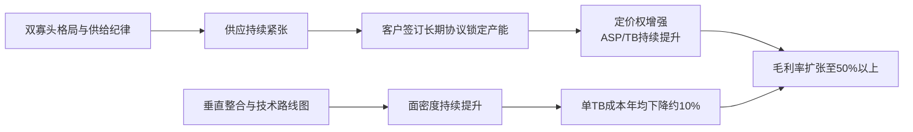

<!-- 匹配到的证券/行业：西部数据(WDC.O) -->
操作成功

### 一页通 （西部数据 (WDC.O)）
日期：2026-08-06
内容："""
## 公司概况

西部数据是全球领先的HDD（机械硬盘）开发商、制造商和供应商，总部位于美国加州圣何塞。公司于2025年2月完成与闪存业务（现闪迪公司）的拆分，转型为纯HDD企业。HDD是数据中心存储海量数据的核心基础设施，凭借其低成本、高容量的特性，在AI驱动的数据爆炸时代占据不可替代的位置。公司产品覆盖云（Cloud）、客户端（Client）和消费者（Consumer）三大终端市场，其中云业务收入占比已达89%，客户高度集中于全球头部超大规模云服务商。  

## 公司近况跟踪

- <strong>FY2026 Q4财报发布（2026年8月5日）</strong>：公司发布FY2026 Q4（截至2026年7月3日）财报，营收<strong>37.47亿美元</strong>，同比增长44%，高于指引上限；毛利率<strong>54.4%</strong>，同比扩张13.1个百分点；Non-GAAP EPS <strong>3.56美元</strong>，同比增长109%。三项核心指标均超市场一致预期。但FY2027 Q1毛利率指引中点为<strong>55.5%</strong>，环比仅扩张1.1个百分点，低于部分买方预期的环比大幅跃升，引发盘后股价下跌。   

- <strong>产品技术路线图加速落地</strong>：公司已开始出货<strong>40TB ePMR</strong>近线硬盘，并预计到FY2027 Q3，该产品将占近线EB出货量的<strong>50%</strong>。<strong>44TB HAMR</strong>产品目前在四家客户处进行认证，计划于<strong>2027日历年上半年</strong>出货，客户反馈在容量、性能和可靠性方面超出预期。UltraSMR技术渗透率持续提升，预计到FY2027年末将占近线EB出货量的约<strong>60%</strong>。  

- <strong>长期协议（LTA）能见度延伸至2031年</strong>：管理层在Q4业绩电话会上透露，客户对LTA的需求强劲，正在与客户讨论建立覆盖<strong>2029、2030、2031年</strong>的LTA。此前已有一份与大型客户的LTA覆盖至2029年。这表明客户对HDD供应安全的担忧加剧，愿意以更长周期的承诺来锁定未来产能。 

- <strong>资本回报力度加大</strong>：Q4单季回购<strong>10亿美元</strong>股票，FY2026全年通过回购和股息向股东返还<strong>31亿美元</strong>。公司已完成剩余闪迪股份的货币化，资产负债表转为净现金头寸。董事会宣布季度股息上调至每股<strong>0.15美元</strong>。 

- <strong>近线EB出货增速短期放缓</strong>：Q4近线EB出货同比增长<strong>22%</strong>，低于前几个季度30%以上的增速。管理层解释主要由于大客户采购节奏的非线性和产品组合（CMR vs UltraSMR）的季度间波动所致，并预计随着40TB产品放量，增速将重新加速。 

## 短期逻辑

1. <strong>FY2027 Q1毛利率指引的预期差博弈</strong>：公司给出的FY2027 Q1毛利率指引中点为55.5%，环比仅扩张1.1个百分点。这与主要竞争对手希捷在同期给出的激进毛利率扩张指引形成鲜明对比。部分买方分析师认为该指引存在显著保守倾向，其依据是：若维持Q4的定价同比增速（高双位数），隐含的Q1成本/TB降幅仅为4%，远低于公司长期10%的成本下降目标。若实际毛利率在3个月后兑现为57%-58%，将构成重要的业绩超预期催化剂。但若连续两个季度毛利率扩张乏力，市场可能开始质疑其成本控制能力和定价权。   

2. <strong>40TB ePMR产品放量节奏</strong>：公司已开始出货40TB ePMR产品，并计划在FY2027 Q3实现近线EB出货占比50%。该产品较当前32TB产品容量提升25%，将直接驱动单TB成本下降和平均售价提升。Q3将是验证该产品能否如期大规模放量的关键观察窗口。若进展顺利，将显著改善公司的EB增速和毛利率结构，弥合与竞争对手之间的增速差距。  

3. <strong>AI推理与Agentic AI主题催化</strong>：市场对AI投资回报率的焦虑正在上升，而公司管理层在电话会上清晰阐述了HDD在AI推理和Agentic AI时代的核心定位——推理生成的数据必须被持久化存储，且约<strong>80%</strong>的超大规模数据中心数据存储在HDD上。这一叙事若被更广泛的市场接受，将有助于HDD板块从“周期性硬件”向“AI基础设施受益者”的估值范式切换。 

## 长期逻辑

1. <strong>AI驱动的数据存储需求结构性增长</strong>：管理层预计长期EB需求增速将超过<strong>25%</strong>。增长驱动力来自三个层面：1）核心云服务（视频、协作工具）的持续增长；2）AI工作负载从训练向推理和Agentic AI的转变，每次推理都生成需要存储的新数据；3）物理AI（自动驾驶、机器人）需要生成和存储海量合成数据来训练模型。这些驱动力并非简单叠加，而是形成“推理生成数据→Agentic系统消耗并生成更多数据→物理AI生成合成数据”的复合增长循环。HDD凭借其在规模、经济性和能效方面的优势，是承载这一数据洪流的核心基础设施。 

2. <strong>寡头垄断格局下的供给纪律</strong>：全球HDD市场由西部数据、希捷和东芝三家主导，其中西部数据和希捷合计占据超过80%的市场份额。与历史上HDD行业周期性产能过剩不同，当前行业龙头均明确表态<strong>不增加单位产能</strong>，而是通过提升单盘面密度（areal density）来增加单盘容量。这种“不扩产、只提密度”的供给策略，从根本上改变了行业的供需结构，使定价权和利润率得以长期维持在较高水平。  

3. <strong>技术路线图支撑长期成本下降与容量增长</strong>：公司采用ePMR和HAMR双轨技术策略。ePMR可支撑至60TB容量，而HAMR是实现100TB以上容量的关键技术路径。公司计划在2027年上半年出货44TB HAMR产品，2027年下半年推出50TB产品，远期规划超过100TB。随着面密度的持续提升，每TB成本有望以年均约<strong>10%</strong>的速度下降，这将在维持高毛利率的同时，持续扩大HDD相对于SSD的TCO（总拥有成本）优势，巩固其在近线存储领域的不可替代性。 

## 风险提示

- <strong>HAMR量产爬坡不及预期的风险</strong>：HAMR是公司实现100TB以上容量目标的关键技术，但其制造工艺复杂，涉及全新的磁头、介质和激光加热组件。管理层坦承，从ePMR向HAMR过渡的良率学习曲线将比ePMR代际升级更具挑战性。若HAMR在2027年上半年的量产爬坡进度、良率或可靠性方面出现显著延迟，可能导致公司错失向客户交付更高容量产品的时间窗口，从而在与希捷（已批量交付HAMR产品）的竞争中处于不利地位，影响市场份额和定价能力。 

- <strong>客户集中度与需求波动风险</strong>：公司云业务收入占比高达89%，前三大客户合计贡献超过40%的收入。尽管LTA提供了中长期的需求可见性，但客户采购节奏的非线性（如Q4所呈现的EB增速放缓）仍可能导致季度间业绩出现较大波动。若个别超大规模客户因宏观经济、自身资本开支节奏或技术架构调整等原因，削减或推迟存储采购，将对公司短期业绩产生显著冲击。  

- <strong>NAND/SSD技术替代的长期风险</strong>：尽管当前HDD在近线存储领域拥有显著的TCO优势，但NAND闪存的价格持续下降和QLC/PLC等更高密度技术的成熟，可能在长期内侵蚀HDD的市场空间。若未来SSD与HDD的单TB成本差距从当前的约6-8倍显著缩小，部分对性能有更高要求的温数据存储工作负载可能转向SSD，从而压缩HDD的潜在市场空间。 

## 近期要闻

- <strong>2026年5月1日</strong>：公司发布FY2026 Q3财报，营收33.37亿美元，毛利率首次突破50%大关至50.5%，并宣布与客户的LTA期限已延伸至2028和2029年。 

- <strong>2026年5月-6月</strong>：多家华尔街投行（摩根士丹利、花旗、美银等）密集上调公司目标价，主要基于AI驱动的HDD需求强劲、定价环境改善以及LTA能见度提升。 

- <strong>2026年6月中旬至7月</strong>：受AI板块整体回调、杠杆资金平仓等因素影响，公司股价从约800美元的高点持续回落，至7月下旬累计跌幅超过30%。 

- <strong>2026年7月29日</strong>：主要竞争对手希捷公布超预期的FY2026 Q2财报，并给出激进的毛利率环比扩张指引（约5-6个百分点），股价大涨。市场对西部数据即将发布的财报预期随之升温。  

- <strong>2026年8月5日</strong>：公司发布FY2026 Q4财报，营收和EPS均超预期，但FY2027 Q1毛利率指引环比扩张幅度低于部分买方预期，盘后股价一度下跌超过10%。  

## 未来催化

- <strong>2026年8月-10月</strong>：FY2027 Q1（9月季度）实际业绩公布。若实际毛利率兑现为57%-58%（高于指引中点的55.5%），将验证市场对其指引保守的判断，并可能触发股价修复。 

- <strong>2026年下半年</strong>：40TB ePMR产品大规模放量。该产品的出货量爬坡速度和客户采纳情况，将是验证公司EB增速能否重新加速至30%以上的关键。 

- <strong>2027年上半年</strong>：44TB HAMR产品开始出货。这是公司技术路线图上的里程碑事件，其量产进度和客户反馈将直接影响市场对其长期技术竞争力的评估。 

- <strong>2026年11月20日-24日</strong>：公司年度股东大会。管理层可能更新长期财务目标、资本配置计划以及对行业供需格局的最新判断。 

## 公司业务模式及拆分

### 业务边际变化

公司于2025年2月完成与闪存业务的拆分，转型为纯HDD企业。这一战略举措使公司业务结构发生根本性简化，从同时经营HDD和NAND闪存两大周期性业务，转变为专注于HDD这一核心能力。拆分后，公司资源更加聚焦于HDD的技术创新（ePMR、UltraSMR、HAMR）和产能优化，客户结构也进一步向云服务商集中。 

### 盈利模式

公司依靠技术壁垒和规模垄断盈利。HDD行业是高度资本和技术密集型行业，涉及材料科学、纳米技术、精密机械和固件开发等多个尖端领域，新进入者极难在短期内复制。公司通过垂直整合（自研磁头、介质和控制器）和持续的面密度提升，实现单TB成本的持续下降，同时通过向云客户提供高容量、高可靠性的产品来获取定价权。当前，公司盈利模式正从历史上的“周期性成本竞争”向“结构性价值创造”转变，即通过为客户提供更优的TCO来分享价值。  

### 业务拆分

公司业务按终端市场划分为云（Cloud）、客户端（Client）和消费者（Consumer）三大板块。云业务是绝对核心，收入占比从FY2025的88%进一步提升至FY2026 Q4的89%，是公司增长和盈利的主要驱动力。客户端和消费者业务虽然占比较小，但在当前供应紧张的环境下，受益于更接近现货市场的定价机制，呈现出更高的价格弹性。公司当前处于<strong>业绩兑现期</strong>，前期投入的技术和产能正在转化为强劲的财务回报。  

<strong>细分业务拆分（按终端市场）</strong>

| 项目 | FY2025 | FY2025占比 | FY2026 Q4 | FY2026 Q4占比 | FY2026 Q4同比 |
|---|---|---|---|---|---|
| <strong>云</strong> | 83.41亿美元 | 88% | 33.00亿美元 | 89% | +43% |
| <strong>客户端</strong> | 5.56亿美元 | 6% | 2.25亿美元 | 6% | +61% |
| <strong>消费者</strong> | 6.23亿美元 | 7% | 1.87亿美元 | 5% | +38% |
| <strong>合计</strong> | 95.20亿美元 | 100% | 37.47亿美元 | 100% | +44% |

*注：公司未单独披露各终端市场的毛利率。*

<strong>云业务</strong>：FY2026 Q4收入33.00亿美元，同比增长43%，环比增长12%。增长主要来自高容量近线企业级HDD的强劲需求，以及有利的定价环境。云业务是公司收入和利润的基石，其增长由超大规模数据中心的容量扩展和AI数据存储需求驱动。 

<strong>客户端业务</strong>：FY2026 Q4收入2.25亿美元，同比增长61%，环比增长26%。该业务主要为PC OEM和渠道客户提供高性能HDD。增长受益于定价改善，以及PC市场对更大容量存储的需求。 

<strong>消费者业务</strong>：FY2026 Q4收入1.87亿美元，同比增长38%，环比持平。该业务包括外置HDD和零售产品，受益于公司品牌认知度和全球渠道布局。定价改善是收入增长的主要驱动力。 

## 核心竞争力

<strong>竞争要素 1：依托寡头垄断格局与供给纪律构筑的定价权</strong>

- <strong>护城河定性</strong>：<strong>结构性护城河</strong>。全球HDD市场由西部数据和希捷双寡头主导，合计份额超过80%。与历史上行业频繁的产能扩张和价格战不同，当前双寡头均明确承诺不增加单位产能，仅通过提升单盘面密度来增加容量供给。这种“不扩产、只提密度”的供给纪律，从根本上改变了行业的供需结构，使定价权得以长期维持在有利于供应商的水平。HDD制造长达52周的交付周期，进一步强化了供应端的刚性。  

- <strong>数据验证</strong>：公司FY2026 Q4混合平均每TB价格同比增长<strong>高双位数</strong>（上季度为高个位数），定价增速正在加速。FY2026全年毛利率<strong>49.1%</strong>，同比扩张9.7个百分点；Q4毛利率<strong>54.4%</strong>，同比扩张13.1个百分点。FY2026全年自由现金流<strong>35亿美元</strong>，自由现金流利润率<strong>27%</strong>。 

- <strong>动态演变</strong>：<strong>护城河变宽</strong>。客户对供应安全的担忧加剧，正主动寻求签订覆盖至2029、2030、2031年的长期协议（LTA），以锁定未来产能。这表明供给侧的约束正在转化为更长期、更稳固的定价框架，而非短期的供需错配。 

<strong>竞争要素 2：垂直整合与技术路线图构筑的成本优势</strong>

- <strong>护城河定性</strong>：<strong>结构性护城河</strong>。公司是HDD行业垂直整合程度最高的厂商之一，自研并制造绝大部分的磁头和介质。这种整合模式使其能够更紧密地控制核心组件的技术迭代、质量和成本，减少对外部供应商的依赖。公司通过ePMR和HAMR双轨技术策略，持续推动面密度提升，这是降低单TB成本最有效的途径。  

- <strong>数据验证</strong>：公司长期每TB成本下降目标约为<strong>10%</strong>。FY2026 Q4每TB成本同比下降约<strong>8%</strong>。公司已开始出货40TB ePMR产品（较32TB容量提升25%），并计划在2027年上半年出货44TB HAMR产品。UltraSMR技术通过固件优化可额外提供约20%的容量提升，且几乎不增加成本，预计到FY2027年末将占近线EB出货量的约60%。 

- <strong>动态演变</strong>：<strong>护城河变宽</strong>。公司正持续投资于磁头、介质和自动化，以提升生产效率和产品性能。随着HAMR技术在2027年进入量产，面密度提升将进入新的加速阶段，进一步拉大与潜在竞争对手的技术差距，并巩固成本优势。 

<strong>现阶段核心驱动力总结</strong>：

公司的Alpha来源于其在寡头垄断市场中的定价权和通过技术领先实现的成本控制能力。Beta则来源于AI驱动的全球数据量爆炸式增长，这是整个HDD行业的需求顺风。当前阶段，Alpha和Beta形成共振，推动公司进入历史性的盈利扩张周期。 

<strong>竞争格局传导逻辑图</strong>：

## 产销链

### 客户情况

公司客户高度集中于全球头部超大规模云服务商。FY2026 Q4，前十大客户贡献了<strong>71%</strong>的收入，其中前三大客户分别占<strong>17%、15%和11%</strong>。这种高集中度是行业特性，一方面为公司提供了强劲且持续的需求，另一方面也带来了客户采购节奏波动和潜在的议价压力风险。为管理这一风险，公司与客户签订的LTA期限已延伸至2029年，并正在商讨覆盖至2031年的协议。LTA通常约定基础EB量和对应定价，超出基础量的部分适用不同的定价机制，为公司提供了增量收益机会。  

### 供应商情况

公司是垂直整合程度最高的HDD厂商，自研并制造绝大部分的磁头和介质，这降低了对核心组件外部供应商的依赖。对于其他组件和材料，公司通常维持多个供应商，但对于某些业务或技术原因必需的组件，也存在单一或少数来源供应商。公司位于亚洲（泰国、马来西亚、菲律宾、中国）的工厂负责组装和测试。 

### 成本传导能力

公司赚取的是<strong>技术壁垒和规模垄断带来的品牌溢价</strong>。当上游原材料或制造成本上升时，公司具备较强的成本转嫁能力。这体现在其定价策略上：公司通过为客户提供更高容量、更优TCO的产品，以可预测的方式持续提升单TB价格，从而覆盖成本上升并实现利润率扩张。FY2026 Q4，单TB价格同比上涨高双位数，而单TB成本同比下降约8%，共同驱动了毛利率的显著扩张。 

## 财务数据

| 项目 | FY2024 | FY2025 | FY2026 |
|---|---|---|---|
| <strong>截止日期</strong> | 2024-06-28 | 2025-06-27 | 2026-07-03 |
| <strong>营业总收入（亿美元）</strong> | 63.17 | 95.20 | 129.19 |
| 收入同比 | 0.99% | 50.70% | 35.70% |
| <strong>营业成本（亿美元）</strong> | 45.44 | 58.28 | 65.70 |
| <strong>毛利润（亿美元）</strong> | 17.73 | 36.92 | 63.49 |
| <strong>毛利率</strong> | 28.07% | 38.78% | 49.14% |
| <strong>营业利润（亿美元）</strong> | 0.97 | 21.30 | 48.17 |
| 营业利润率 | 1.54% | 22.37% | 37.29% |
| <strong>归母净利润（亿美元）</strong> | -8.52 | 18.40 | 94.24 |
| <strong>基本每股收益（美元）</strong> | -2.61 | 5.31 | 24.67 |
| <strong>经营活动现金流净额（亿美元）</strong> | -2.94 | 16.91 | 39.29 |
| <strong>自由现金流（亿美元）</strong> | -7.81 | 12.84 | 35.11 |

*注：自由现金流 = 经营活动现金流净额 - 资本性支出。FY2026归母净利润包含闪迪股权投资收益等非经常性项目。*

### 财务分析

<strong>成长能力</strong>：公司FY2026营收同比增长35.7%至129.19亿美元，较FY2024的63.17亿美元已实现翻倍。增长主要由云业务驱动，该业务受益于AI数据中心的容量扩张和有利的定价环境。Non-GAAP EPS从FY2025的4.97美元增长至FY2026的10.24美元，增幅超过100%。 

<strong>盈利能力</strong>：公司盈利能力正处于历史性扩张通道。毛利率从FY2024的28.07%跃升至FY2026的49.14%，累计提升超过21个百分点。营业利润率从1.54%飙升至37.29%，体现了显著的经营杠杆效应。盈利能力的核心驱动力是：1）向高容量驱动器的产品结构迁移；2）全产品组合的有利定价；3）严格的成本控制和制造效率提升。 

<strong>运营能力与现金流</strong>：公司FY2026经营活动现金流净额为39.29亿美元，自由现金流为35.11亿美元，自由现金流利润率高达27%。强劲的现金流生成能力使公司在FY2026年偿还了大量债务，资产负债表转为净现金头寸，同时通过回购和股息向股东返还了31亿美元。 

## 行业及竞争分析

### 行业分析

公司处于HDD（机械硬盘）行业，该行业是数据中心存储基础设施的核心组成部分。HDD通过磁记录技术在旋转盘片上存储数据，其核心竞争力在于以最低的单TB成本提供海量存储容量。 

- <strong>需求端</strong>：需求正经历由AI驱动的结构性爆发。传统云服务（视频、协作工具）的数据量持续增长，而AI工作负载从训练向推理和Agentic AI的转变，正在创造全新的、持续的数据存储需求。每一次AI推理都会生成需要持久化存储的新数据。此外，物理AI（自动驾驶、机器人）需要生成和存储海量合成数据来训练模型。管理层预计，长期数据存储容量（EB）需求的复合年增长率将超过<strong>25%</strong>。 

- <strong>供给端</strong>：行业供给呈现刚性特征。HDD制造是一个高度复杂、资本密集且交付周期长达52周的过程。当前，全球HDD市场由西部数据和希捷两家主导，两者均明确表态不增加单位产能，仅通过提升单盘面密度来增加单盘容量。这种供给纪律从根本上改变了行业的供需结构。  

- <strong>技术趋势</strong>：行业正处在从传统PMR（垂直磁记录）向HAMR（热辅助磁记录）和MAMR（微波辅助磁记录）等能量辅助记录技术过渡的关键时期。这些新技术能够实现更高的面密度，是未来实现100TB以上单盘容量的关键技术路径。 

### 竞争格局

全球HDD市场呈现高度集中的寡头垄断格局。西部数据和希捷是两大主导厂商，合计占据超过80%的市场份额，东芝占据剩余份额。  

<strong>可比公司</strong>

| 公司名称 | 股票代码 | 对标维度 | 分析 |
|---|---|---|---|
| 希捷科技 | STX | 直接竞争对手 | 在HAMR技术商业化上领先，已批量交付44TB HAMR产品。FY2026 Q2毛利率和EB增速均优于西部数据，显示出更强的短期执行力和成本控制能力。 |
| 东芝 | - | 次要竞争对手 | 市场份额较小，在近线企业级HDD领域的技术和规模与两大龙头存在差距。主要聚焦于MAMR技术路线。 |

<strong>总结分析</strong>：西部数据与希捷共同构成了HDD行业的双寡头。当前，两者均受益于AI驱动的强劲需求，但希捷在HAMR技术商业化和近期的财务指标（EB增速、毛利率扩张速度）上展现出一定的领先优势。西部数据的差异化优势在于其更高的垂直整合程度和UltraSMR技术带来的成本效益。两者之间的竞争焦点在于技术路线图的执行速度和成本控制能力。由于市场需求远超供给，当前阶段的竞争更多体现在谁能更快地提升容量和获取增量利润，而非传统的价格战。   

## 市场焦点议题

<strong>1. 毛利率扩张的持续性与节奏</strong>

- <strong>背景</strong>：公司FY2026 Q4毛利率54.4%，但FY2027 Q1指引中点为55.5%，环比仅扩张1.1个百分点。这与主要竞争对手希捷在同期给出的激进扩张指引形成鲜明对比，引发了市场对公司成本控制能力和定价权持续性的担忧。历史上，HDD行业的利润率具有强周期性，市场对当前高利润率的可持续性存在天然质疑。  
- <strong>问题列表</strong>：
  - FY2027 Q1毛利率指引是否过于保守？实际毛利率能否兑现为57%-58%？
  - 随着HAMR产品在2027年上半年开始出货，其对毛利率的影响是正面还是负面？管理层表示HAMR初期将是毛利率中性的。 
  - 长期协议（LTA）的定价机制是否限制了公司在现货市场价格飙升时的利润弹性？

<strong>2. 近线EB出货增速放缓的原因与前景</strong>

- <strong>背景</strong>：FY2026 Q4近线EB出货同比增长22%，低于前几个季度30%以上的增速。管理层解释为季度间客户采购节奏和产品组合波动所致，但市场担心这是否是需求增速放缓的早期信号。 
- <strong>问题列表</strong>：
  - 22%的EB增速是一次性的季度波动，还是增速中枢下移的开始？
  - 40TB ePMR产品在FY2027 Q3能否如期实现近线EB出货占比50%的目标，从而重新加速EB增长？
  - 客户采购的非线性波动是否会对公司产能规划和业绩可预测性构成持续挑战？

<strong>3. HAMR技术商业化的执行风险</strong>

- <strong>背景</strong>：HAMR是实现100TB以上容量的关键技术，也是公司长期竞争力的核心。公司计划在2027年上半年出货44TB HAMR产品，而竞争对手希捷已批量交付HAMR产品。市场高度关注公司能否如期、高质量地完成这一技术跨越。 
- <strong>问题列表</strong>：
  - HAMR产品在2027年上半年的量产爬坡能否按计划进行？良率和可靠性是否能达到目标水平？
  - 与希捷相比，公司的HAMR产品在性能、成本和客户认证进度上处于什么位置？
  - 在HAMR大规模量产前，ePMR和UltraSMR技术路线能否有效支撑公司的市场竞争力和财务表现？

## 市场分歧探讨

<strong>核心分歧：当前的高毛利率和强劲需求是结构性的新常态，还是周期性顶峰？</strong>

- <strong>乐观方（结构性观点）</strong>：认为AI驱动的数据爆炸是长期结构性趋势，HDD作为存储海量数据最具成本效益的解决方案，其需求将多年保持25%以上的增速。同时，行业双寡头明确的供给纪律（不增加单位产能）从根本上改变了历史上的产能过剩和价格战问题。长期协议（LTA）的签订和延长，为未来的收入和定价提供了前所未有的可见性。因此，当前的高毛利率具备可持续性，公司应享受更高的估值倍数。 

- <strong>谨慎方（周期性观点）</strong>：认为当前的需求繁荣部分源于超大规模客户对AI的恐慌性投资和过度建设，未来存在资本开支消化期或需求不及预期的风险。HDD技术最终可能面临NAND闪存或其他新型存储技术的替代威胁。尽管当前供给紧张，但高利润率最终会刺激新的投资或竞争，历史上的周期规律难以被彻底打破。当前股价和估值已充分反映了乐观预期，任何需求或定价的边际走弱都可能导致股价大幅回调。 

<strong>分析视角</strong>：从FY2026 Q4财报来看，乐观方的核心论据——强劲需求和有利定价——得到了进一步验证，单TB价格同比增速从高个位数加速至高双位数。但谨慎方的担忧也找到了新的论据：近线EB出货增速放缓至22%，以及毛利率指引的环比扩张幅度低于预期。这表明，即使在强劲的需求环境下，季度间的业绩波动依然存在，且公司的成本控制和利润释放节奏可能受到产品过渡（向40TB和HAMR切换）和客户采购节奏的扰动。当前阶段，需求端的结构性叙事依然强劲，但供给端（公司自身的执行）和估值端（高预期）的风险正在累积。 

## 盈利预测与估值

| 机构 | 评级 | 目标价 | 财务指标 | FY2026E | FY2027E | FY2028E |
|---|---|---|---|---|---|---|
| 摩根士丹利 (2026-08-06) | 超配 | 676美元 | 营业收入(百万美元) | 12,919 | 20,305 | 30,892 |
| | | | EPS(美元) | 10.24 | 23.50 | 45.36 |
| 高盛 (2026-08-06) | 中性 | 650美元 | 营业收入(百万美元) | 12,935 | 18,894 | 23,483 |
| | | | EPS(美元) | 9.50 | 18.49 | 25.38 |
| 花旗 (2026-08-06) | 买入 | 800美元 | 营业收入(百万美元) | - | - | - |
| | | | EPS(美元) | 10.10 | 21.04 | 33.28 |
| 美银 (2026-07-02) | 买入 | 732美元 | 营业收入(百万美元) | 12,917 | 18,763 | 28,655 |
| | | | EPS(美元) | 9.95 | 18.72 | 32.89 |

<strong>管理层最新指引</strong>：FY2027 Q1（截至2026年9月）营收预计为<strong>40亿至42亿美元</strong>，毛利率<strong>55%-56%</strong>，Non-GAAP EPS为<strong>3.85至4.15美元</strong>。    

<strong>分析</strong>：主流券商对公司的评级普遍为“买入”或“超配”，目标价在650至800美元之间，显示出市场对公司长期前景的普遍看好。盈利预测方面，机构间对FY2027和FY2028的EPS预测存在较大分歧，例如FY2028 EPS预测范围从25.38美元到45.36美元，差异接近一倍。这反映了市场对HDD行业本轮上行周期的持续性和盈利峰值的高度不确定性。估值方法上，机构普遍采用市盈率（P/E）估值法，基于未来2-3年的盈利预期进行定价。当前市场对公司FY2027年EPS的一致预期约为18-23美元，对应约22-28倍远期P/E。
"""
