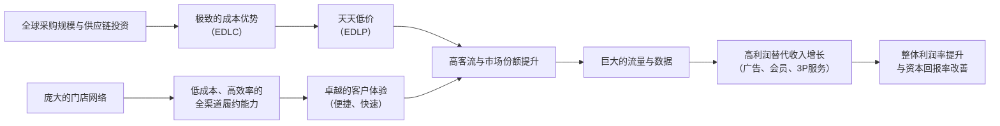

# Gangtise 公司一页通：沃尔玛（WMT.O）

> 拉取日期：2026-07-30 ｜ 来源：gangtise-agent `stock-one-pager`

## 公司概况

沃尔玛是全球最大的零售商，以“天天低价”（EDLP）为核心策略，运营覆盖美国本土、国际及山姆会员店三大板块。截至FY2026（截至2026年1月31日），公司在全球19个国家拥有近10,955家门店，每周服务约2.7亿顾客，全年总收入达**7,131.63亿美元**。公司正从传统实体零售商向“以人为本、技术驱动的全渠道零售商”转型，通过电商、广告、第三方市场和会员服务等业务构建生态闭环。  

## 公司近况跟踪

- **FY27 Q1业绩稳健，但利润增速受成本扰动**：FY27 Q1（截至2026年4月30日）总收入**1,777.51亿美元**，同比增长**7.3%**（固定汇率增长5.9%），超市场预期。但营业利润**74.93亿美元**，同比仅增**5.0%**，低于收入增速，主因**约1.75亿美元**未预期的柴油成本及业务重组费用拖累。经调整后，营业利润增速约7.5%。  

- **价格投资加码，但资金来源明确**：2026年7月6日，沃尔玛宣布在沃尔玛美国及山姆会员店进行新一轮降价，覆盖食品杂货、家清、户外等品类。管理层明确表示，资金来源于**约30亿美元**的关税退税（此前未纳入年度指引），并非额外利润侵蚀。此举旨在强化价值定位、加速市场份额获取。  

- **核心管理层持续调整**：继CEO更替后，沃尔玛美国首席运营官Kieran Shanahan于2026年7月离任，由国际业务COO Kyle Kinnard接任。此前，山姆会员店COO也已离职。管理层换血反映新任CEO John Furner正重塑其核心团队。 

- **会员与电商生态持续壮大**：FY27 Q1全球电商销售同比增长**26%**，美国市场第三方（3P）GMV增长近50%。全球广告业务增长**37%**（Walmart Connect增长44%），会员费收入增长**17.4%**，二者合计贡献约**三分之一**的营业利润。摩根士丹利6月调查显示，Walmart+会员数达创纪录的约**3,180万**。  

- **AI应用深化**：公司推出的AI购物助手Sparky已覆盖约半数沃尔玛App用户，其客单价较未使用者高出约**35%**。公司正与多家前沿模型公司合作，探索代理式商务，但强调人机协同，不追求完全自动化。  

## 短期逻辑

1.  **价格投资驱动的市场份额加速获取**：沃尔玛于7月初宣布的新一轮降价，正值Kroger新CEO宣布将加大价格投资之后，市场担忧行业价格战升级。但沃尔玛的降价资金明确来自关税退税，而非利润再投资，这为其在即将到来的**返校季（7-9月）**提供了独特的进攻窗口。管理层在6月会议上指出，其价格差距已处于有利位置，且降价并非新策略。结合FY27 Q1美国食品杂货销量增长**4.2%**、一般商品同店销售意外加速至近**5%**的数据，本轮降价有望在FY27 Q2（截至7月31日）进一步放大其客流和市场份额优势，尤其是在中低收入消费者承压、寻求价值的背景下。市场对价格战冲击利润的担忧可能过度。   

2.  **FY27 Q2业绩的预期差博弈**：公司对FY27 Q2的指引为收入增长4%-5%，调整后营业利润增长7%-10%，EPS为0.72-0.74美元。多家机构（如古根海姆、高盛）认为该指引偏保守。核心依据在于：1）Q1超预期的**1.75亿美元**柴油成本将在Q2通过定价部分回收；2）Q2将开始同比消化FY26 Q2因一般责任险增加**约4亿美元**准备金带来的低基数效应；3）电商和广告等高利润业务增长势头不减。若Q2业绩超预期，有望扭转自Q1财报发布以来股价相对标普500指数**约700个基点**的跑输局面，启动新一轮“超预期-上调”周期。  

3.  **关税退税的财务弹性释放**：沃尔玛预计将获得约**30亿美元**的关税退税，管理层明确表示将用于再投资价格和消费者。尽管退税到账节奏非线性，但这一额外资金来源为公司在不牺牲利润率的条件下，应对潜在的宏观压力（如油价波动、消费疲软）和竞争挑战提供了缓冲垫。随着退税在下半年逐步到账并投入使用，其对销售的拉动效应和利润的稳定作用将逐步显现。  

## 长期逻辑

1.  **电商盈利拐点驱动整体利润率结构性扩张**：沃尔玛美国电商业务长期处于亏损状态，但改善路径清晰。Bernstein估算，FY26其核心电商EBIT利润率约为**-6%**（完全分摊、未补贴口径）。通过自动化履约中心（FC）降本、提升配送密度与路径优化、发展“暗店”网络扩大即时配送覆盖，电商亏损有望持续收窄，并可能在**FY30实现盈亏平衡**。仅此一项，预计可为沃尔玛美国EBIT利润率贡献约**100个基点**的提升。这是公司从低毛利零售向高价值全渠道平台转型的核心财务逻辑。 

2.  **高利润替代收入（广告+会员）的飞轮效应**：沃尔玛的零售媒体（Walmart Connect）和会员（Walmart+）业务正形成强大的飞轮效应。电商GMV增长（预计FY26-FY30 CAGR约**18%**）扩大了广告库存，3P卖家增长增加了广告需求，而Vizio的收购则打开了联网电视（CTV）广告的增量空间。Bernstein预测，零售媒体广告收入将从FY26的约**44亿美元**增至FY30的**113亿美元**，其高利润率特性可为沃尔玛美国EBIT利润率再贡献约**75个基点**。同时，会员费增长（FY27 Q1增17.4%）不仅贡献高毛利收入，更通过提升用户粘性和钱包份额，反哺零售主业。 

3.  **全渠道护城河的持续加固**：沃尔玛正将其独特的资产——**4,600+家美国门店**（90%美国人10英里内）——转化为难以复制的竞争优势。通过门店履约（Store-fulfilled）实现低成本、高效率的即时配送，FY27 Q1美国市场**36%**的订单实现3小时内送达，**60%**的美国人口可享受30分钟达服务。这种“店仓一体”模式相比纯前置仓模式具有显著的成本和覆盖优势。叠加自动化供应链（约55%-60%门店年内由自动化DC供货）、数字价签（年底全覆盖）等技术投入，公司在运营效率、库存管理和客户体验上的领先优势正在扩大，构成了长期份额增长的坚实基础。  

## 风险提示

- **竞争加剧与价格战风险**：美国食品杂货行业正经历管理层大换血，Kroger、Albertsons等主要竞争对手新CEO均表态将加大价格投资，行业可能进入新一轮以效率提升和成本节约再投资于价格的竞争周期。尽管沃尔玛是价格领导者，但若竞争导致行业性毛利率压缩，其利润增速可能承压。 

- **消费疲软与油价波动的双重压力**：沃尔玛核心客群对价格敏感度高。管理层在FY27 Q1后指出，低收入消费者压力加大，高油价（若持续高于5美元/加仑）将进一步挤压其可支配收入。同时，公司自身也面临燃油成本上涨对运输和履约费用的直接冲击，FY27 Q1柴油成本已对营业利润造成**250个基点**的拖累。若宏观经济恶化，销售增长和利润率均面临挑战。  

- **管理层变动带来的执行风险**：自新任CEO John Furner上任以来，沃尔玛美国、山姆会员店及国际业务的核心高管已发生多起变动。虽然管理层迭代可能带来新思路，但短期内也可能导致战略执行的断层或延迟，尤其是在公司正处于全渠道转型和AI技术投入的关键时期。 

## 近期要闻

- **2026年5月21日**：沃尔玛发布FY27 Q1财报。收入超预期，但营业利润增速受柴油成本和重组费用拖累，仅增5%，不及收入增速，股价当日承压。  
- **2026年6月10日**：在Evercore消费者与零售峰会上，公司高管阐述了增长业务组合（广告、3P、会员）的战略定位，并强调了AI助手Sparky在提升用户转化和客单价方面的积极作用。 
- **2026年7月6日**：沃尔玛宣布在沃尔玛和山姆会员店进行大规模降价，涉及食品、家清、玩具等品类，资金来源于关税退税。此举引发市场对行业价格战的担忧，但公司强调此举符合其一贯的价值定位。  
- **2026年7月17日**：据华尔街日报等媒体报道，沃尔玛美国首席运营官Kieran Shanahan将于本周离任，由国际业务COO Kyle Kinnard接任，这是新任CEO上任以来对核心管理团队的又一次调整。 

## 未来催化

- **2026年8月中旬（预计）**：FY27 Q2财报发布。市场关注在价格投资加码和消费环境波动背景下，公司能否实现甚至超越其保守的收入和利润指引，尤其是美国同店销售增长和毛利率变化。  
- **2026年7月-9月（返校季）**：作为美国仅次于年末假日季的消费旺季，返校季是检验沃尔玛新一轮降价策略成效的关键窗口。其在一般商品（尤其是服饰、电子）和食品杂货上的价格竞争力，将直接影响该季度的销售表现和市场份额变化。 
- **2026年9月24日前后（待确认）**：美国前总统特朗普称预计届时会见中方领导人。若中美经贸关系出现阶段性缓和信号，可能对沃尔玛的供应链成本、关税政策及消费者信心产生积极影响。 

## 公司业务模式及拆分

### 业务边际变化

沃尔玛正经历从传统零售商向全渠道生态平台的深刻转型。核心变化在于，其增长引擎正从单一的门店销售，转向由**电商、广告、第三方市场（3P）、会员服务和数据变现**构成的“第二利润曲线”。这些高利润业务在FY27 Q1合计贡献了约**三分之一**的营业利润，正结构性改善公司的盈利能力和增长质量。同时，公司持续投入供应链自动化、AI技术和门店改造，以提升运营效率和客户体验。  

### 盈利模式

沃尔玛的盈利模式建立在**极致的规模效应和成本控制（EDLC）**之上，通过“天天低价（EDLP）”策略吸引海量客流，实现高周转和稳定的薄利多销。在此基础上，公司正通过构建生态闭环，将巨大的流量和交易数据货币化，发展出**高利润的替代收入**，包括：1）**广告费**（Walmart Connect）；2）**会员费**（Walmart+、山姆会员店）；3）**第三方卖家服务费**（佣金、履约服务费WFS）；4）**数据订阅服务费**（Scintilla）。这种“零售引流+服务变现”的模式，正逐步提升公司整体的利润率和资本回报率。  

### 业务拆分

公司业务分为三大核心板块：**沃尔玛美国、沃尔玛国际和山姆会员店美国**。FY27 Q1，沃尔玛美国仍是收入和利润的绝对主力，但国际业务受益于汇率和电商增长，增速最快。山姆会员店凭借会员费提价和强劲的客流，贡献了稳定的利润。公司正处于**业绩兑现期**，高利润替代收入正逐步从“故事”转化为“财务贡献”。  

**细分业务拆分（按报告分部）**

| (单位：百万美元) | FY25 Q1 | FY26 Q1 | FY27 Q1 |
| :--- | :--- | :--- | :--- |
| **截止日期** | 2024-04-30 | 2025-04-30 | 2026-04-30 |
| **沃尔玛美国** | | | |
| 净销售额 | 108,700 | 112,163 | 117,169 |
| 同比 | - | 3.2% | 4.5% |
| 占总收入比 | 67.2% | 67.7% | 65.9% |
| 营业利润 | 5,300 | 5,696 | 5,897 |
| 营业利润率 | 4.9% | 5.1% | 5.0% |
| **沃尔玛国际** | | | |
| 净销售额 | 29,800 | 29,754 | 35,110 |
| 同比 | - | -0.3% | 18.0% |
| 占总收入比 | 18.4% | 18.0% | 19.8% |
| 营业利润 | 1,500 | 1,293 | 1,602 |
| 营业利润率 | 5.0% | 4.3% | 4.6% |
| **山姆会员店美国** | | | |
| 净销售额 | 21,400 | 22,064 | 23,405 |
| 同比 | - | 2.9% | 6.1% |
| 占总收入比 | 13.2% | 13.3% | 13.2% |
| 营业利润 | 600 | 666 | 674 |
| 营业利润率 | 2.8% | 3.0% | 2.9% |

*注：数据来源于公司财报。分部营业利润为财报披露口径，包含公司间接费用分摊。*

**沃尔玛美国**：FY27 Q1净销售额**1,171.69亿美元**，同比增长**4.5%**，同店销售（不含燃料）增长**4.1%**。增长由交易量和客单价共同驱动，食品杂货和一般商品均表现强劲，其中服饰品类实现双位数增长。毛利率因品类组合改善和高利润业务增长而提升**29个基点**，但营业费用率因折旧、医疗成本和业务重组费用增加而上升**56个基点**，导致营业利润率微降。电商销售额贡献了约**5.2%**的同店销售增长，主要由门店履约的配送服务驱动。  

**沃尔玛国际**：FY27 Q1净销售额**351.10亿美元**，同比增长**18.0%**，其中汇率波动贡献了约**7.9%**的增长。按固定汇率计算，销售额增长**10.1%**。中国（同店销售增长13%）和加拿大（同店销售增长7%）表现突出。毛利率同比持平，但营业费用率因成本控制和业态组合变化而改善**28个基点**，推动营业利润增长**23.9%**（按报告口径）。 

**山姆会员店美国**：FY27 Q1净销售额**234.05亿美元**，同比增长**6.1%**，同店销售（含燃料）增长**5.9%**。增长主要由交易量和单位销量驱动，食品杂货和一般商品表现强劲。燃料销售因价格上涨和销量增加而增长，对同店销售贡献了**2.1%**。会员费收入增长**11.0%**，得益于会员基数扩大和Plus渗透率提升。毛利率因电商履约成本增加而下降**26个基点**，营业利润率微降。公司已于2026年5月1日上调会员费（Club会员从50美元涨至60美元，Plus会员从110美元涨至120美元），预计将在未来几个季度贡献增量收入。 

## 核心竞争力

**竞争要素 1：依托极致规模与效率构筑的成本领先护城河**

-   **护城河定性**：这是沃尔玛最核心的**结构性护城河**。其全球采购规模（FY26总收入**7,131.63亿美元**）赋予其强大的供应商议价能力，使其能以最低成本获取商品。同时，公司长期坚持“天天低成本”（EDLC）理念，通过持续投资供应链自动化、数字化和门店运营优化，将成本效率转化为“天天低价”（EDLP）的定价能力，形成“低价→高客流→大规模→更低成本”的正向循环。这种规模-成本优势是竞争对手在短期内难以复制的。 
-   **数据验证**：尽管是低毛利零售商，沃尔玛的ROI（投资回报率）在FY27 Q1的过去12个月为**14.9%**，ROA（资产回报率）为**8.4%**，显示出其强大的资产运营效率。其美国食品杂货价格较同行平均低约**15.4%**，且价格差距仍在扩大。FY27 Q1，其美国食品杂货销量增长**4.2%**，远超多数同行，直接体现了成本优势转化为市场份额的能力。  
-   **动态演变**：**护城河变宽（巩固）**。公司正将投资重点从门店扩张转向供应链自动化、AI和数字化，旨在进一步拉大与竞争对手在效率和成本上的差距。例如，其自动化配送中心正在提升库存准确性和门店补货效率，数字价签则降低了门店人工成本。  

**竞争要素 2：以门店网络为根基的全渠道生态平台**

-   **护城河定性**：这是沃尔玛正在快速构建的**结构性护城河**。其遍布美国的**4,600+家**门店（90%美国人口10英里内）不仅是零售终端，更是电商履约的“前置仓”。这种“店仓一体”模式使其能以远低于纯电商的获客和履约成本，提供覆盖范围最广、速度最快的即时配送服务（60%美国人口可享30分钟达）。在此基础上，公司叠加了第三方市场、广告、会员、金融等服务，构建了一个高粘性、多维度变现的生态平台。这种线上线下融合的资产规模和生态协同效应，是纯电商或纯实体零售商难以企及的。  
-   **数据验证**：FY27 Q1，美国电商销售同比增长**26%**，其中门店履约的配送和自提是主要驱动力。Walmart+会员数创历史新高，其消费频次和客单价显著高于非会员。广告业务（Walmart Connect）收入同比增长**44%**，其高利润率已成为公司利润增长的重要引擎。这些数据证明了生态飞轮正在加速运转。  
-   **动态演变**：**护城河变宽（巩固）**。公司正通过建设“暗店”网络、扩大无人机配送（Q1完成超50万次配送）、整合Vizio的CTV广告能力等举措，不断拓宽和加深其全渠道生态的护城河。  

**现阶段核心驱动力总结**：

沃尔玛的Alpha来源于其**从传统零售商向全渠道生态平台的转型**，这正在结构性提升其盈利能力和增长可持续性。其Beta属性则体现为**必需消费品零售商的防御性**，在经济不确定性加剧、消费者寻求价值时，其低价定位和食品杂货主业使其具备较强的业绩韧性。 

**竞争格局传导逻辑图**：

## 产销链

- **客户情况**：沃尔玛服务约**2.7亿**全球客户，客户基础极为分散，无单一客户依赖风险。其核心客群为大众消费者，对价格敏感度高。近年来，公司通过改善商品品质（如服饰、自有品牌）和全渠道体验，成功吸引了更多中高收入客群。FY27 Q1，美国市场各收入阶层份额均有所增长，其中高收入家庭渗透率提升显著。管理层指出，低收入消费者行为更趋谨慎，而中高收入群体支出保持稳健。  

- **供应商情况**：沃尔玛拥有全球数万家供应商，采购集中度低，议价能力极强。公司通过“天天低成本”（EDLC）理念，与供应商建立长期、大规模的合作关系，以获取最优采购价格。同时，公司也通过供应商融资计划（Supplier Financing Program）优化营运资金，FY27 Q1末该计划下未偿付款项为**59亿美元**。公司正利用数据产品（Scintilla）帮助供应商优化决策，深化合作关系。当上游原材料或燃料成本上涨时，沃尔玛凭借其规模和谈判力，既能部分消化成本压力，也能通过供应商协同和定价策略将部分成本转嫁，其赚取的是“规模效率+服务变现”的钱，而非单纯的“加工费”或“周期资源钱”。  

- **经销商情况**：沃尔玛以直营模式为主，不依赖传统经销商体系。其全球超过**10,900家**门店和电商平台直接面向消费者。对于第三方市场（3P）卖家，沃尔玛提供Walmart Fulfillment Services（WFS）等履约服务，帮助卖家提升配送速度和客户体验，并从中获取服务收入。FY27 Q1，美国3P市场GMV增长近**50%**，WFS承接了约**45%**的3P订单。  

## 财务数据

**关键财务数据**

| (单位：亿美元，除每股数据外) | FY2024 | FY2025 | FY2026 | FY27 Q1 |
| :--- | :--- | :--- | :--- | :--- |
| **截止日期** | 2024-01-31 | 2025-01-31 | 2026-01-31 | 2026-04-30 |
| **总收入** | 6,481.25 | 6,809.85 | 7,131.63 | 1,777.51 |
| 同比 | 6.0% | 5.1% | 4.7% | 7.3% |
| **营业成本** | 4,901.42 | 5,117.53 | 5,353.95 | 1,330.58 |
| **毛利润** | 1,579.83 | 1,692.32 | 1,777.68 | 446.93 |
| **毛利率** | 24.4% | 24.9% | 24.9% | 25.1% |
| **营业利润** | 270.12 | 293.48 | 298.25 | 74.93 |
| 同比 | 32.2% | 8.6% | 1.6% | 5.0% |
| **营业利润率** | 4.2% | 4.3% | 4.2% | 4.2% |
| **归母净利润** | 155.11 | 194.36 | 218.93 | 53.30 |
| 同比 | 32.8% | 25.3% | 12.6% | 18.8% |
| **稀释每股收益（美元）** | 1.91 | 2.41 | 2.73 | 0.67 |
| **自由现金流** | 151.20 | 126.60 | 149.23 | -19.46 |

*注：数据来源于公司财报。FY27 Q1为单季度数据，同比增速为与FY26 Q1对比。自由现金流为经营活动现金流减去资本支出。*

**财务分析**

- **成长能力**：公司收入增速稳健，FY26为**4.7%**，FY27 Q1受汇率和并购影响加速至**7.3%**。利润端，FY26归母净利润增速**12.6%**，慢于FY25的**25.3%**，主因营业利润率受一次性因素（如PhonePe股权激励费用、一般责任险费用增加）拖累。FY27 Q1归母净利润增速回升至**18.8%**，但营业利润增速仅**5.0%**，反映出替代收入增长与成本压力并存的局面。  

- **盈利能力**：毛利率在FY25和FY26稳定在**24.9%**，FY27 Q1小幅提升至**25.1%**，显示品类组合改善和高利润业务增长的积极影响。然而，营业利润率在FY26下滑至**4.2%**，FY27 Q1持平，主要受SG&A费用率上升的侵蚀。SG&A费用率从FY24的**20.4%**持续上升至FY26的**20.9%**，FY27 Q1进一步升至**21.2%**，反映了公司在技术、供应链和人力上的持续投资，以及一次性费用（如柴油成本、重组费用）的影响。公司正处于“投资换增长”阶段，利润率的扩张有待高利润业务规模效应的进一步释放。  

- **运营能力**：公司运营效率极高，表现为负的营运资本。FY26存货周转天数约**39天**，应付账款周转天数约**43天**，意味着公司能在支付供应商货款前售出商品，占用供应商资金进行运营。FY27 Q1，因季节性备货，存货增加，导致自由现金流为负**19.46亿美元**，属于正常经营波动。  

- **偿债能力与股东回报**：公司财务杠杆稳健，FY26末净债务/EBITDA约为**0.8倍**。公司持续通过分红和回购回报股东，FY26分红**75.07亿美元**，回购**80.88亿美元**，合计**155.95亿美元**，略超当年**149.23亿美元**的自由现金流。公司于2026年2月批准了新的**300亿美元**回购计划，彰显了其对未来现金流和财务状况的信心。  

## 行业及竞争分析

沃尔玛所处的美国零售行业，尤其是**食品杂货和日用百货零售**，是一个规模巨大但增长缓慢、竞争激烈的市场。行业正经历结构性变革，核心趋势包括：1）**电商渗透率持续提升**，尤其是食品杂货的线上化正在加速；2）**消费者价值意识增强**，在经济压力和通胀影响下，消费者更倾向于寻求低价和高性价比；3）**技术驱动的效率竞争**，AI、自动化、数据能力正成为零售商构建差异化优势的关键；4）**业态分化明显**，会员制仓储店（如山姆、Costco）和折扣店（如Aldi）表现优于传统大卖场。 

沃尔玛凭借其“天天低价”策略和全渠道布局，在行业变革中处于优势地位，持续从传统超市和百货公司手中夺取市场份额。其核心竞争对手包括：

**可比公司分析**

| 公司名称 | 股票代码 | 对标维度 | 分析 |
| :--- | :--- | :--- | :--- |
| **Costco** | COST | 会员制仓储模式 | 同为全球零售巨头，在会员店业态上直接竞争。Costco全球同店销售增速强劲（FY27 Q1美国同店增8%），会员续费率极高。沃尔玛的山姆会员店在商业模式上对标Costco，但规模较小。两者均受益于消费者对高性价比商品的需求。 |
| **Amazon** | AMZN | 电商与云计算生态 | 沃尔玛在电商、广告和云计算（AWS vs. 零售媒体）领域的主要竞争对手。亚马逊在电商市场份额领先，但沃尔玛凭借门店网络在食品杂货和即时配送上建立差异化优势。两者正互相渗透对方腹地。 |
| **Kroger** | KR | 传统食品杂货连锁 | 美国最大的传统超市运营商之一，是沃尔玛在食品杂货领域的主要竞争对手。Kroger近期更换CEO并宣布加大价格投资，显示其正面临沃尔玛的激烈竞争，行业价格战风险加大。 |
| **Target** | TGT | 多品类折扣零售 | 定位比沃尔玛更偏时尚和家居，客群收入水平略高。Target同样在推进全渠道和自有品牌战略，但规模和食品杂货占比不及沃尔玛。近期业绩承压，市场份额有所流失。 |

**总结分析**：沃尔玛的竞争策略已从单纯的“低价”升级为“低价+便捷+生态”。其核心竞争优势在于无与伦比的规模、门店网络和由此衍生的全渠道履约能力。与Costco相比，沃尔玛的业态更多元，覆盖客群更广；与Amazon相比，其在食品杂货和线下即时履约上具有结构性优势；与传统超市相比，其成本优势和数字化能力领先。当前行业竞争加剧，但沃尔玛凭借其飞轮效应和资金实力（关税退税），处于最有利的竞争位置，有望在行业洗牌中进一步扩大市场份额。  

## 市场焦点议题

**议题一：价格战风险与利润率前景**

- **背景**：美国食品杂货行业正经历一轮管理层更替，Kroger、Albertsons等主要竞争对手的新任CEO均表态将加大价格投资以夺回市场份额。叠加沃尔玛7月初宣布的大规模降价，市场担忧行业将陷入价格战，进而侵蚀所有参与者的利润率。历史上，沃尔玛曾多次利用其成本优势发动价格战以清理市场。  
- **问题列表**：
    - 沃尔玛此轮降价的资金来源是关税退税，这是否意味着其为一次性行为，而非长期价格战的开启？
    - 在竞争对手跟进降价的情况下，沃尔玛的毛利率和营业利润率能否维持在指引范围内（FY27营业利润增长6%-8%）？
    - 除了价格，沃尔玛在商品差异化（自有品牌）、服务和体验上的投资，能否使其在价格战中保持客流和客户忠诚度？

**议题二：高利润替代收入的增长可持续性与天花板**

- **背景**：广告、会员和3P服务已成为沃尔玛利润增长的核心驱动力，FY27 Q1贡献了约三分之一的营业利润。市场给予沃尔玛高估值，很大程度上是基于对这些高利润业务未来增长潜力的预期。然而，随着基数扩大，这些业务的增速自然放缓，市场对其能否持续超预期存在疑虑。  
- **问题列表**：
    - Walmart Connect广告业务在FY27 Q1增长44%，其长期增长空间有多大？能否如部分机构预测，在FY30达到110亿美元以上规模？
    - 3P市场GMV增长迅速，但其货币化率（Take Rate）和盈利能力如何？何时能成为利润的重要贡献者而非投入期？
    - Walmart+会员增长在FY27 Q1创下新高，其渗透率天花板在哪里？会员费提价（如山姆会员店）是否会引发用户流失？

**议题三：管理层变动与战略执行连续性**

- **背景**：自2026年2月新任CEO John Furner上任以来，沃尔玛美国、山姆会员店及国际业务的核心高管已发生多起变动，包括美国COO、山姆COO等关键职位。市场关注这一系列变动是否意味着公司战略方向或执行层面将出现重大调整。 
- **问题列表**：
    - 新任管理层团队的战略重点与前任有何异同？是否会调整现有的投资计划和资本配置策略？
    - 多位核心高管离职，是否会影响公司正在推进的供应链自动化、门店改造和AI技术部署等关键项目的执行进度？
    - 新任美国COO来自国际业务，这是否意味着公司将加强美国业务与国际业务之间的协同和最佳实践共享？

## 市场分歧探讨

**核心分歧：当前估值溢价是否可持续？即，沃尔玛应被视作稳健但低增长的零售股，还是高增长、高利润的生态平台股？**

- **乐观方观点（平台化重估逻辑）**：
    - **增长动力切换**：认为沃尔玛已不是传统零售商，其增长引擎已切换至广告、3P服务、会员等高利润、高增长业务。这些业务正带来结构性的利润率扩张，其估值体系应从传统的PE/PS切换至分部估值法（SOTP），对标亚马逊、Shopify等平台公司。 
    - **护城河加深**：强调其“店仓一体”的全渠道模式在即时零售时代具有独特优势，是亚马逊等纯电商难以复制的。AI技术的应用（如Sparky）将进一步提升用户粘性和钱包份额，巩固其生态壁垒。 
    - **业绩验证**：引用FY27 Q1电商GMV、广告收入和会员费的高速增长数据，以及高利润业务对利润贡献的显著提升，证明转型故事正在兑现为财务业绩。  

- **谨慎方观点（估值泡沫与风险定价不足）**：
    - **估值脱离地心引力**：认为当前近**39倍**的远期市盈率已充分甚至过度反映了乐观预期。即便考虑FY28的盈利增长，市盈率仍在**34倍**左右，对于一个整体收入增速仅**4%-5%**、核心零售业务利润率微薄的零售商来说，估值偏高。  
    - **竞争风险被低估**：指出美国食品杂货行业正面临新一轮价格战风险，亚马逊在电商和广告领域仍是强大对手，而Temu、SHEIN等新势力也在争夺市场份额。沃尔玛能否在激烈的竞争中持续实现利润率扩张，存在不确定性。 
    - **投资回报周期长**：认为市场对电商盈利、AI变现等长期故事的定价过于超前。这些投资需要数年时间才能产生显著回报，且执行风险不容忽视。当前股价已price in了大部分未来利好，容错空间小。 

**总结分析**：沃尔玛正处于一个关键的转型期，其从传统零售商向生态平台的跃迁是真实的，并已初步在财务数据上得到验证。乐观方的逻辑在长期维度上成立，但谨慎方对短期估值和竞争风险的担忧同样合理。核心分歧在于对“转型速度”和“确定性”的判断。若公司能在未来几个季度持续证明其高利润业务能驱动整体利润率扩张，并有效应对竞争，则其估值溢价将得到支撑；反之，若增长放缓或利润率承压，则可能面临“戴维斯双杀”。   

## 盈利预测与估值

**管理层最新指引**（FY27 Q1财报）：

- **FY27全年**：按固定汇率计算，净销售额增长**3.5%至4.5%**；调整后营业利润增长**6%至8%**；调整后EPS为**2.75至2.85美元**。 
- **FY27 Q2**：净销售额增长**4%至5%**；调整后营业利润增长**7%至10%**；调整后EPS为**0.72至0.74美元**。 

**券商盈利预测与估值**

| 机构 | 评级 | 目标价(美元) | 财务指标 | FY26A | FY27E | FY28E | FY29E |
| :--- | :--- | :--- | :--- | :--- | :--- | :--- | :--- |
| **Bernstein** (2026-07-14) | 跑赢大盘 | 145.00 | 调整后EPS(美元) | 2.64 | 3.09 | 3.60 | - |
| **高盛** (2026-07-17) | 买入 | 154.00 | EPS(美元) | 2.65 | 2.97 | 3.37 | 3.84 |
| **瑞银** (2026-06-13) | 买入 | 141.00 | EPS(美元) | 2.64 | 2.90 | 3.50 | 4.13 |
| **古根海姆** (2026-05-28) | 买入 | 137.00 | 调整后EPS(美元) | 2.65 | 2.85 | 3.13 | - |
| **美银** (2026-07-13) | 买入 | 144.00 | EPS(美元) | 2.64 | 2.90 | 3.20 | 3.53 |
| **中金** (2026-05-25) | 跑赢行业 | 138.00 | EPS(美元) | 2.73 | 2.97 | 3.30 | - |

*注：数据来源于各机构研究报告。预测数据均为各机构基于其模型得出的预期，非公司官方指引。*

**盈利预期与估值分析**：

主要券商对沃尔玛均持积极看法，评级均为“买入”或“跑赢大盘”。对FY27的EPS预测集中在**2.85至2.97美元**之间，与公司指引的**2.75-2.85美元**上限接近或略高，显示市场普遍预期公司能实现指引上沿。对FY28的EPS预测分歧较大，范围在**3.13至3.60美元**，反映了市场对利润率扩张速度的不同假设。      

估值方法上，由于沃尔玛的盈利正从低利润零售向高利润服务转型，单纯使用PE估值可能低估其价值。机构普遍采用PE估值法，但给出的目标倍数较高（如Bernstein基于39倍FY28E EPS，瑞银基于40倍CY27E EPS），隐含了对转型成功的溢价。古根海姆则同时采用EV/EBITDA（22.9倍FY26E）进行交叉验证。Bernstein在其报告中创新性地使用了“成熟期盈利折现”法，认为若将FY30的预期利润率折现回当前，其“真实”市盈率约为**27倍**，低于历史平均的**29倍**，从而论证当前估值仍有上行空间。
